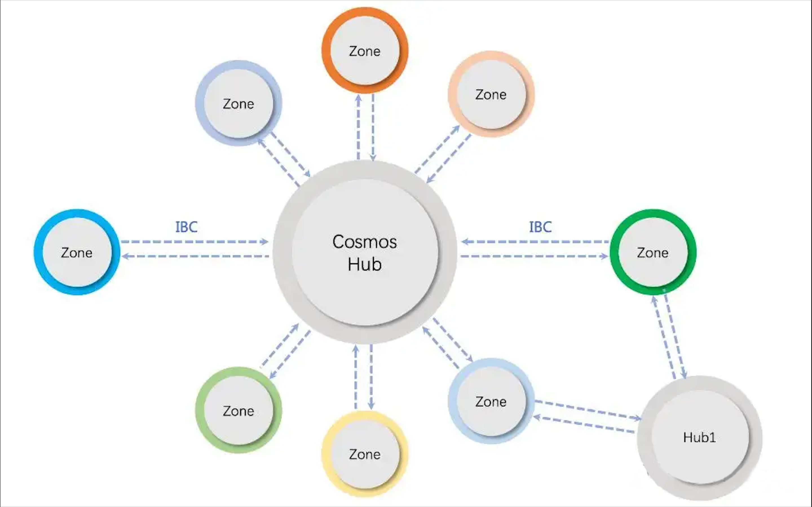
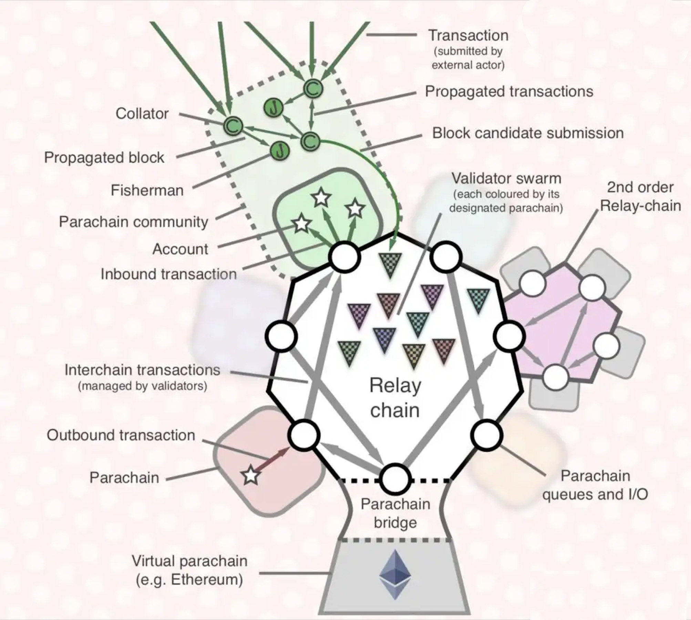
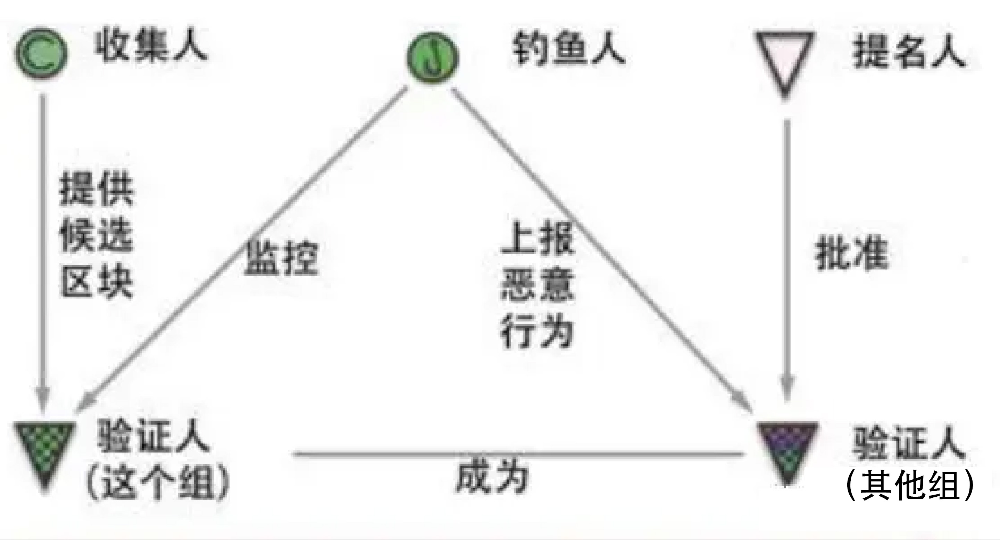
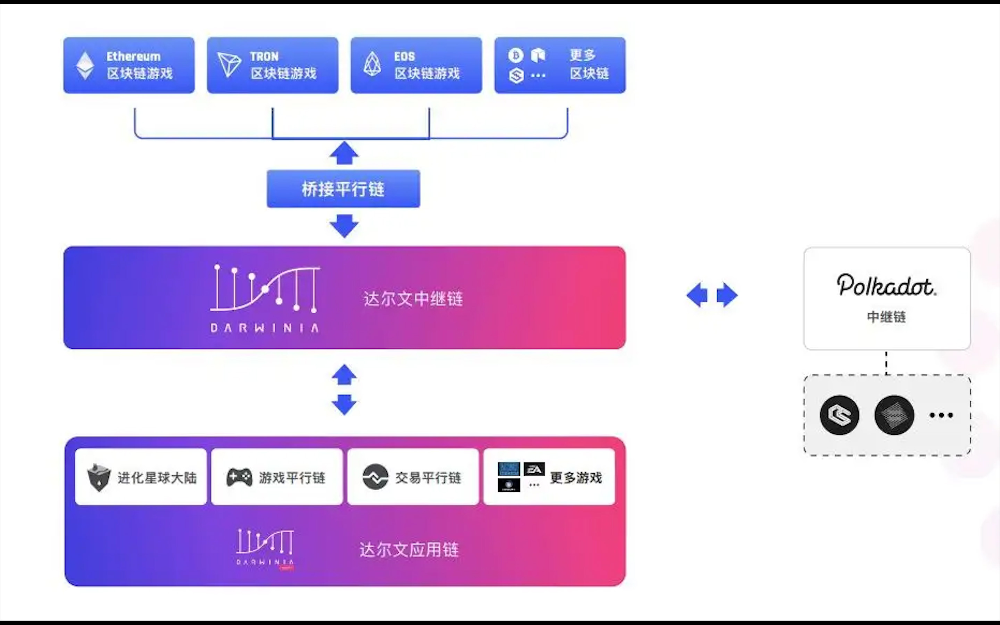
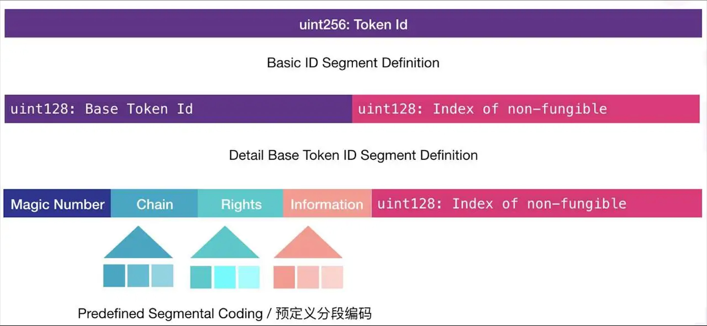
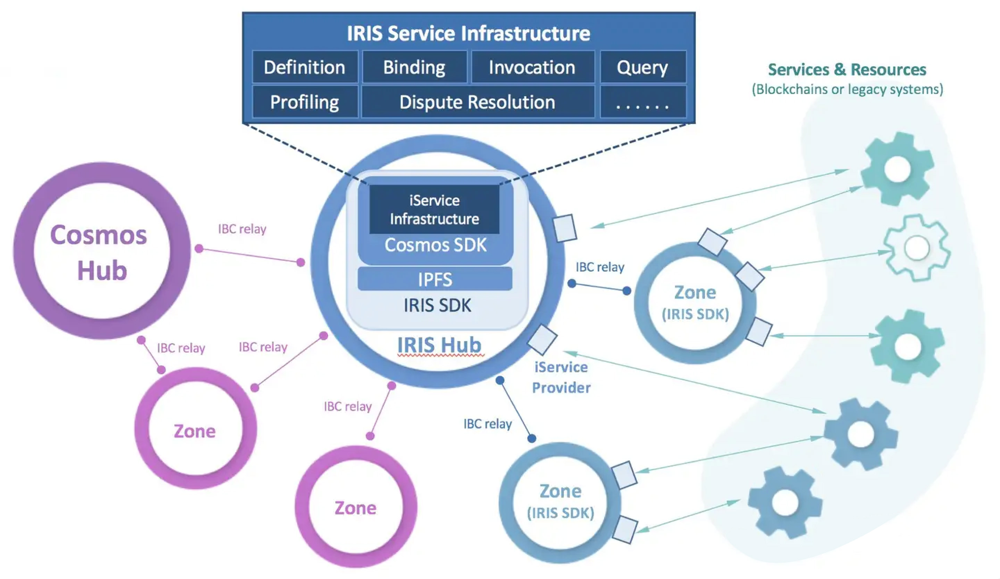

# 跨链的简要研究：从原理到技术

## 1 Abstract

**跨链技术本质上是一种将 A 链上的数据 D（或信息 I，或消息 M）安全可信地转移到 B 链并在 B 链上产生预期效果的一种技术。** 因为区块链系统本来就是一种特殊的分布式账簿数据库系统，所以这个转移的数据，最常见的就是资产的数据，如代币余额。

目前主流的区块链跨链技术方案按照其具体的实现方式主要有：公证人机制、哈希锁定、侧链&中继链、分布式私钥控制。

目前最有名的跨链项目有 Cosmos 和 Polkadot，两者采用的都是基于中继链的多链多层架构。由此可见，侧链&中继链技术将会是未来跨链技术的主力。

本文首先简要介绍跨链的技术原理。其中会简要介绍公证人机制、哈希锁定，详细介绍侧链&中继链技术。然后本文将介绍几个相关的跨链项目，包括基于 ETH 的 Plasma、基于 Polkadot 的达尔文网络，基于 Cosmos 的 IRIS。

## 2 公证人机制及哈希锁定

跨链交互根据所跨越的区块链底层技术平台的不同可以分为同构链跨链和异构链跨链。同构链之间安全机制、共识算法、网络拓扑、区块生成验证逻辑都一致，它们之间的跨链交互相对简单。而异构链的跨链交互相对复杂，如 Bitcoin 采用 PoW 算法而 Fabric 采用传统确定性共识算法，其区块的组成形式和确定性保证机制均有很大不同，直接跨链交互机制不易设计。异构链之间的跨链交互一般需要第三方辅助服务辅助跨链交互。

跨链要达到安全可信必然对跨链机制、步骤等有一些要求，其中最重要的就是跨链事务的原子性。对于普通的链内交易来说，交易需要支持原子性——交易如果失败则需要回滚。而跨链的交易也是如此，其失败时要回滚涉及本次交易两条或多条链的交易。

### 2.1 公证人机制（Notary schemes）

公证人也称见证人机制，其是一种中介的方式。设区块链 A 和 B 本身是不能直接进行互操作的，那么他们可以引入一个共同信任的第三方作为中介，由这个共同信任的中介进行跨链消息的验证和转发。很多时候，这个公证人/中介就是交易所。其优点在于支持异构的区块链跨链，缺点在于有中心化风险，只能实现交换不能实现转移。

跨链交易实例：假设 Alice 想和 Bob 进行 1 个 BTC 换 50 个 ETH 的交易

1. Alice 将自己的 1 个 BTC 存入交易所的比特币地址;Bob 将自己的 50 个 ETH 存入交易所的以太坊地址；
2. Alice 在交易所上挂单：1 BTC for 50 ETH；
3. Bob 通过交易所完成与 Alice 的交易，Alice 得到 50 ETH，Bob 得到 1 BTC

- 这里会有不少的形式。一种是 Bob 挂出购买比特币的单子，然后交易所撮合。一种是 Bob 直接看到 Alice 挂出卖单，然后直接要这个卖单。

4. Alice 将交易所得的 50 ETH 提币到自己的以太坊账户；Bob 将交易所得的 1 BTC 提币到自己的比特币账户；

通过引入中介完成了 Alice 和 Bob 的 BTC 和 ETH 的交换。通过该例子可以看出交易所的方式目前仅能够支持资产的交换，且资产交换的原子性、安全性完全由中心化的交易所保障，故存在一定的中心化风险。

### 2.2 哈希锁定（Hash-locking）

哈希锁定的典型实现是哈希时间锁定合约 HTLC(Hashed TimeLock Contract)。哈希时间锁定最早出现在比特币的闪电网络。哈希时间锁定巧妙地采用了哈希锁和时间锁，迫使资产的接收方在 deadline 内确定收款并产生一种收款证明给打款人，否则资产会归还给打款人。收款证明能够被付款人用来获取接收人区块链上的等量价值的数量资产或触发其他事件。哈希锁定只能做到交换而不能做到资产或者信息的转移，因此其使用场景有限。

跨链交易实例（仍以前一节中的交易需求为例）：

1. Alice 随机构建一个字符串 s，并计算出其哈希 h；
2. Alice 将 h 发送给 Bob；
3. Alice 通过合约锁定自己的 1 个 BTC 资产，设置一个较长的锁定时间 T1, 再设置了获取该 BTC 的条件：Bob 提供 h 的原始值 s;
4. Bob 锁定 50ETH 到自己的合约，设置一个相对较短的锁定时间 T2(T2 < T1)。再设置 50ETH 的获取条件：Alice 提供 h 的原始值 s；
5. Alice 将字符串 s 发送到 Bob 的合约获得 50 个 ETH;
6. Bob 观察到步骤 5 中 Alice 的 s 值，将其发送给 Alice 的合约成功获取 1 个 BTC; 至此完成资产的交换。
7. 如果超时，则锁定的资产返回原主。

从上述的过程可以看出哈希时间锁定合约有一些约束条件：

- 双方必须能够解析双方的合约内部数据，例如 s，例如锁定资产的证明等；
- 哈希锁定的超时时间设置时需要保证存在时间差，这样在单方面作弊时另一方可以及时撤回自己的资产。

## 2.3 分布式私钥控制

cure Multi-Part Computation）和门限密钥共享机制（Threshold Key Sharing Scheme）的技术。分布式私钥控制其实和跨链并没有什么关系，也没有解决跨链 2 个难点中的一个。其将中继链账户的私钥分为冗余的多份，然后分发给验证人，可以防止某个验证人在在跨链资产交换的解锁锁定阶段的单方作恶，因为只有多个验证人集合起来才拥有私钥。

## 3 侧链/中继链

### 3.1 侧链的含义及意义

首先，什么是侧链？

在一开始，主链特指比特币主网区块链。所以所谓侧链就是除了比特币区块链以外的，任何能遵循侧链协议并和比特币互通的一切区块链。侧链使得比特币有更好的流动性；而在比特币主网上开发应用很困难，现在通过再侧链上开发应用再使用互通方式与主链连接可以解决这个问题——间接使用了比特币，进一步巩固了比特币的中心地位。

不过，现在自然已经不能说主链特指比特币了。根据维基百科上的说法：“侧链用来指代与主区块链并行的那条区块链。来自主区块链的 entries 可以向侧链连接，也可以被侧链连接；这样一来，侧链就可以独立于主区块链进行操作（例如，通过使用备用的记录保持方式）。一个侧链模型是驱动链。”

这个说法包含三个要点：

1. 侧链是相对的。我们不能单纯的说某条链 B 是侧链，而必须说这条链 B 可以是链 A 的侧链。
2. 侧链与主链是独立的。链 B 可以有自己的功能，在它自己运行时不需要链 A 的支持。如果 B 链发生运行故障或被中心化控制，不会直接影响到 A 链本身的运行（但可以间接影响，比如 B 链被控制后，A 链还依旧与之交互）。
3. 侧链与主链可以连接互通，即跨链。当要实现跨链的功能时才需要 B 链和 A 链进行互通。因为侧链的互通机制是其最主要的功能，所以常常将侧链与主链的互通叫做侧链技术。至于侧链本身是否包含在侧链技术之中，不同的项目有不同的看法。

其次，侧链的意义？

从主链单链角度讲，侧链可以虚拟化地横向和纵向提升主链的性能。所谓横向，就是将多个侧链与主链互通，将大部分交易放到侧链上，然后再通过与主链互通实现，可以虚拟地提升主链的 TPS。所谓纵向，就是侧链可以有主链不具有的功能，通过侧链，主链看上去也像是支持了这些功能。所谓虚拟化，就是虽然有横向和纵向的提升，但是主链本身并任何没有变化，只是通过众多侧链小弟帮其起到类似代理的作用，使其看上去性能提升。

从全局角度讲，侧链作为跨链技术的一种，自然是为万链互连做出了重要贡献。实现万链互联有两者架构：1. 任何一条链，既有主链的功能，又有侧链的功能（一些资料将拥有侧链功能叫做遵循侧链协议），这就像计算机网络中任何计算机既是主机又是路由器。2. 只有特定的几条链作为主链，其他所有链都只支持侧链功能，就和现在的计算机网络类似，有网络核心部分——单纯的路由器，也有网络的边缘部分——单纯的主机。

### 3.2 侧链的技术

侧链实现是通过双向锚定技术。将暂时的数字货币在主链中锁定，同时将等价的数字资产在侧链中释放。实现双向锚定的最大难点在于协议改造需兼容现有主链，也就是不能对现有主链的工作造成影响。根据[2]的说法，其具体实现方式有：单一托管模式、联盟模式、SPV 模式、驱动链模式、混合模式。

单一托管模式就是类似交易所做中介完成锁币放币，其实和。联盟模式即公证人模式，由多个公证人的多重签名来对转移资产的交易进行签名，避免了中心化。

SPV 模式是通过将交易发给本链的一个特殊地址，由此会自动创建一个 SPV 证明给侧链上并发起一个交易在侧链上解锁对应的资产。驱动链模式是用矿工来作为资金托管方，将资产的监管权发放到数字资产矿工手上，矿工进行投票决定何时解锁资产及将资产发送到何方。混合模式就是将这些侧链机制进行有效结合，对结构不同的链，为其使用最适合其结构的模式，如主链使用 SPV，侧链使用驱动链。

这里 SPV 模式是使用得最多的，也是最有前途的。SPV 就是简单支付验证（Simplified Payment Verification），其能验证交易是否存在。

BTC-Relay 是号称的史上第一个侧链，其通过以太坊构建了一个比特币的侧链，运用以太坊的智能合约允许用户验证比特币的交易。SPV 交易实例（仍以之前的交易需求为例）：

1. Bob 将 50ETH 发送到 BTCSwap 的合约进行冻结(该合约若确认 Bob 接收到来自 Alice 的 1BTC 就自动将 50ETH 转给 Alice)；
2. Alice 确认 Bob 冻结信息后，将 1BTC 转到 Bob 比特币账户；
3. BTC-Relay 将比特币区块头推送到 BTCSwap 合约；Alice 将自己转 BTC 给 Bob 的交易 tx 发给合约 BTCSwap 合约，请求 50ETH;
4. BTCSwap 合约结合 tx 和比特币区块链进行 SPV 验证，验证通过则将 50ETH 转到 Alice 的以太坊地址。

侧链的机制相对哈希锁定而言能够提供更多的跨链交互场景，侧链以及类 SPV 验证的思想适合所有跨链的场景。

### 3.3 中继链

中继链算是公证人机制和侧链机制的融合和扩展，目前社区内最活跃的两个跨链项目 Cosmos 和 Polkadot 采用的都是基于中继链的多链多层架构，其中 Cosmos 目前支持的是跨链资产交互；而 Polkadot 则宣称提供任意类型的跨链交互，但具体实现还有待观察。

### 3.3.1 Cosmos 的中继链机制

为了支持平行链之间的跨链操作，Cosmos 提出了一种跨链交互协议 IBC(Inter-Blockchain Communication Protocol)。

以链 A 到链 B 转账 10token 为例说明使用 IBC 的跨链交互：

1. 互相跟踪。如果 A 要和 B 进行跨链交易，那么 A 和 B 链需要分别运行相当于对方区块链的轻节点，这样可以实时接收到对方的区块头信息（方便后续执行类 SPV 验证）；链 A、链 B 初始化 IBC 协议。
2. 链 A 冻结 10token, 并生成相应的证明发送给链 B。
3. 链 B 接收到相应的 IBC 消息，通过链 A 的区块头信息确定链 A 确实进行相应的资产冻结，然后链 B 会生成等价 10token 的资产。

以上是使用 IBC 协议的两个平行链直接进行跨链的基本过程，如果区块链很多，那么这种方式的两两跨链复杂度会呈现组合级别增加。因此 Cosmos 网络又引入了一种 Hub 的中继链，所有的平行链都通过 IBC 连接到 Hub，让 Hub 辅助跨链交易的验证和资产转移（于是乎，某链能与 Cosmos 体系中的链进行交互=某链能连接到 Hub）。

图 3.1 Cosmos 详细架构

图 3.1 是 Cosmos 网络的详细架构图。一条链从层次结构上讲，分为网络层、公式层、应用层。为方便平行链开发，Cosmos 提供了 tendermint core（简称 tendermint） 和 Cosmos SDK（Go 语言）。其中 tendermint 是指网络层、共识层的封装，而 Cosmos SDK 是应用层中常用的模块：账户、治理、Staking、IBC 等等的封装[4]。因此，自己开发一条新链可以使用 Cosmos SDK+ tendermint，并且由此开发出来的链能直接与 Cosmos Hub 连接（Cosmos Hub 自己本身也是用 Cosmos SDK+tendermint 开发的）。

而对于非 Cosmos SDK 开发的区块链（如已经存在的这些区块链），如果要与 Cosmos 体系中的链进行交互（即能与 Hub 连接），需要使用 Peg Zone 进行桥接，所谓的 Peg Zone 就是使用 Cosmos SDK 开发的，既能接入 Hub 的，又能和原链进行交互的一条链。如图中的 Ethereum，如果要接入 Cosmos Hub，则需要专门使用 Cosmos SDK 开发一条起 Peg Zone 作用的新链。

所谓 Cosmos 主网是指由 Cosmos 团队自己开发的第一个官方版 Hub，也就是不同链进行跨链操作时的第一个中央枢纽。以太坊将是 Cosmos 最先连接的非 Cosmos SDK 开发的公链，目前有两个项目去实现这种连接： Cosmos 开发团队主导的 Ethermint 项目，以及由 Loom Network 主导的 PlasmaChain。这两个项目其实就是开发一个连接以太坊和 Cosmos Hub 的、起 Peg Zone 功能的一条链。

协议应该是各方达成共识的，在 3.1、3.2 小节中说到的“侧链协议”其实并不是真正的协议，因为侧链技术目前没有像计算机网络一样有一些共识的协议，所以其实只能说是侧链机制。而 Cosmos 为跨链带来的最大贡献在于 IBC 协议的设计，IBC 协议提供了一种通用的跨链协议标准。IBC 的设计使得跨链交易可以在多个 Hub 之间进行安全路由和转发，类似目前互联网的 TCP/IP 协议。但是遗憾的是目前的 Cosmos 设计也只能够支持资产的跨链，而且由于不同区块链的业务不同其共识速率的不一致也会影响跨链交易有效性的证明。

这里只讲了 Cosmos 的侧链技术，关于 Cosmos 更多的内容，请看其他参考文献。

### 3.3.2 Polkadot 的中继链机制

图 3.2 Polkadot 架构

Polkadot 的平面体系结构如图 3.2 所示。其有三种链链角色和四种参与方。

三种链角色：

- 中继链（Relay chain）: 中继链位于 Polkadot 的体系的核心地位，主要是为整个系统提供统一的共识和安全性保障；
- 平行链（Parachain）: 在 Polkadot 中平行链负责具体的业务场景，平行链自身不具备区块的共识，它们将共识的职责渡让给了中继链，所有平行链共享来自中继链的安全保障，中继链是 Polkadot 组成的一部分（中继链有可能不是一条链[5]，Polkadot 对其定义是 App 的数据结构，因此可以是 DApp 甚至是一般的 App；不过大部分情况下还会是一条链）；
- 转接桥(Bridges）：在 Polkadot 中转接桥其实有三个含义[6]，其中最重要的含义是：为 Polkadot 体系之外的区块链(如 Bitcoin, Ethereum)提供不同的 Bridge 与 Polkadot 连接在一起进行跨链交互。

三种链角色和 Cosmos 体系中差不多。

四种参与方：

- 验证者(Validator): 验证者负责 Polkadot 的网络出块，会运行一个中继链的客户端，在每一轮区块产生中会对其提名的平行链出的块进行核验。当平行链的块都被他们的验证者集合确定好之后，验证者们会将所有平行链区块头组装到中继链的区块并进行共识。
- 收集人(Collator)，也叫核对人: 帮助验证者收集、验证和提交备选平行链区块，维护了一个平行链的全节点。
- 钓鱼人(Fisherman):钓鱼人主要靠检举非法交易或者区块以获取收益；
- 提名人(Nominator):拥有 stake 的相关方，维护和负责验证者的安全性。

图 3.3 对这些参与方进行了图示说明。整个过程是自动地、去中心化地执行。

图 3.3 Polkadot 四种参与方

用户在平行链发起交易，交易被收集人收集，打包成区块，交给一组验证人去验证。这组验证人并不是来自平行链，而是来自中继链统一管理的验证人池，通过随机分组指定给平行链。

每条平行链都有一个消息输出队列和一个消息输入队列。如果用户发起的是跨链交易，交易就会被放进输出队列。再被目标平行链的收集人放入其输入队列。目标平行链的收集人执行交易，生成区块，由验证人组敲定。

提名人是 Polkadot 基础通证 DOT 的持有者，他希望质押 DOT 获得收益。但是要么是因为 DOT 数量少，要么是缺少运行维护验证人节点的专业技能。因此系统提供了另一个参与途径，就是持币者选择他信任的验证人，把自己的 DOT 通过验证人来质押，分享验证人收益。

渔夫是个软件进程，它监控网络上的非法行为，一旦发现就会向区块链提交举报交易。举报交易也要经过共识过程，通过 2/3 以上验证人验证，打包进区块，惩罚和奖励也都是区块链交易[7]。

在 Polkadot 中如果 Parachain A 需要发送一笔交易到 Parachain B 的过程如下：

- 链 A 将跨链交易放到自己的消息输出队列 engress。
- 链 A 的 Collator 收集 A 链的普通交易以及跨链交易并提交给链 A 的验证者集合。
- 链 A 的验证者集合验证成功，将本次链 A 的区块头信息以及链 A 的 engress 内信息提交到中继链上。
- 中继链运行共识算法进行区块确认以及跨链交易路由，中继链上的验证者会将链 A 的相应交易从链 A 的 engress queue 中移动到链 B 的消息输入队列ingress queue 中。
- 链 B 执行区块，将ingress queue 中相应交易执行并修改自身账本。

以上便是 Polkadot 跨链交易的主要步骤。Polkadot 为应用链提供的工具是 Substrate，目前支持 Rust 语言开发。

## 4 跨链相关项目

### 4.1 ETH.Plasma

以太坊的 Plasma 是 Layer2 扩容的一个方案。Plasma 其原理是将交易移到 off-chain 并在一条次链（Secondary Chain）中进行处理，其想法来自 side chain，但完全一样。但 Plasma 不如 State Channel 来的成熟，目前只有在支付上的应用，数量也很少，正在进行支付以外领域的使用研究。

### 4.2 Polkadot.Darwinia

### 4.2.1 达尔文网络概述

[达尔文网络](https://link.zhihu.com/?target=https%3A//darwinia.network/)，是使用 Polkadot 的 Substrate 的技术构建的跨链游戏网络。达尔文网络的技术其实可以看成是在 Polkadot 的 Substrate 之上的二次开发，将其改进成专门用于游戏资产和游戏操作的跨链交互。目前主要用于支撑进化星球及相关的业务体系（[进化星球](https://link.zhihu.com/?target=https%3A//www.evolution.land/)是一个建立在区块链上的游戏虚拟世界，也是一个 DAO，类似于区块链上的《我的世界》）。主网 Token 是 RING。

达尔文网络的运行模式有 Solo 模式和 Polkadot 模式（值得注意的是，在不同的运行模式下具体的激励方案会有所不同[8]。）。

1）solo 模式。其实，达尔文网络本身自己就是一个的网络，其有自己的中继链。在这个网络中，各种游戏成为达尔文的子世界（子大陆），这个子世界可以是一条使用 Polkadot 的 Substrate 开发的平行链，也可以是 ETH 或者 EOS 上的智能合约。这些子世界接入达尔文网络的中继链的方式和 Polkadot Parachain 接入 Polkadot Relay-chain 一样。

2）Polkadot 模式。达尔文网络整体也可以看做是 Polkadot 的一个 Parachain，并接入 Polkadot 的 Relay-chain。从这个意义上讲，达尔文网络可以被看做是 Polkadot 的一个二阶 Relay-chain (2nd order Relay-chain)

图 4.1 达尔文网络结构

达尔文网络结构见图 4.1。在图中我们看到有一个东西叫做达尔文应用链，达尔文应用链之于达尔文网络等于 Parachain 之于 Polkadot 网络。达尔文应用链是基于 Substrate 和达尔文网络区块链内核（Darwinia Kernel）设计开发的一套应用区块链的框架。

### 4.2.2 星际资产标准

对于游戏资产跨链而言，最重要的自然是资产的数据结构及操作的定义。在达尔文网络官网的[9]中的“NFT 可识别性”部分大致叙述了其星际资产编码标准。其认为在单一网络中，域内的 Token ID 在域内能标识唯一的物品，但是到了互连的环境下则不行。因此其设计了一个星际资产编码标准，让不同公链、不同游戏的资产在达尔⽂网络可以得到唯⼀标识，让游戏资产可以⽅便的跨链转移。
 星际资产编码标准的字段含义如下。

图 4.2 星际资产编码标准字段含义

4.3 Cosmos.IRIS

前面的达尔文网络是 Polkadot 生态中的项目（主网 Token 为 IRIS），而 [IRIS](https://link.zhihu.com/?target=https%3A//www.irisnet.org/) 则是 Cosmos 生态下的项目[10]。其旨在解决的主要挑战有两个：

1. 分布式账本上链外计算和资源的集成与协作

- 解释：IRIS 认为很多事情不应该放到链上或以智能合约的方式来解决，比如一些计算问题
- 解释：IRIS 认为跨链的不应该只是资产，而应该是各种各样的资源（那为什么还选 Cosmos？Cosmos 只支持资产跨链=_=）

1. 跨异构链的服务的互操作性

之前的达尔文网络面向的主要是游戏，而 IRIS 面向的是商业应用(其团队有一位曾在中科院计算技术研究所担任过研究员的博导站台)。IRIS 预设企业和 IRIS 以 Consumer(服务消费方)/Provider(服务提供方)的方式进行合作：IRIS 为企业和项目方提供了更易用的 SDK，来帮助他们利用分布式账本所带来的好处。

说完了 IRIS 的愿景，来看看其网络拓扑结构。

在拓扑结构上，IRIS 和达尔文网络差不多。IRIS 用 Cosmos SDK+ Tendermint 开发的，本身是一个网络，有 Hub，也能接入 Cosmos 生态作为其 Zone。当然 IRIS 是 Cosmos 生态下的，而达尔文网络是 Polkadot 生态下的。

图 4.3 IRIS 网络结构

图 4.3 中显然的内容都不解释了。其中的 iService 其实是 IRIS Services 的简称，其是用来弥合区块链世界与非链应用世界之间的鸿沟的。弥合的方式是协调 Off-Chain 服务的完整生命周期（从其定义、绑定（提供者注册）、调用到其治理（分析和争议解决），就是蓝色表格中的几个内容）。通过增强 IBC 处理逻辑以支持服务语义，IRIS SDK 旨在允许分布式业务服务在整个区块链互联网上可用[11]。

另外，其网络包含三种角色：

- 消费者（Consumers）：通过向网络发送请求并从网络接收响应来使用 Off-Chain 服务。
- 提供者（Providers）：可以提供一个或多个 iService 定义的实现。并且通常充当位于其他公链和企业遗留系统中的基础服务和资源的适配器。提供程序监视并处理传入的请求，将响应发送回网络。通过将请求发送给其他提供者，提供者可以同时充当消费者。
- Profiler：是代表 IRIS Foundation Limited（“基金会”）的特殊用户，IRIS Foundation Limited 是在香港成立的一家有限责任公司。该基金会将领导 IRIS 网络的建设。Profiler 是唯一被授权以配置文件模式调用 iService 的用户，该服务旨在帮助创建和维护目标提供者配置文件，供消费者选择合适的提供者。

### 4.4 其他项目

ChainX、Edgeware 是 Polkadot 生态中非常重要的两个项目，可以说是 Polkadot 生态中的一哥和二哥。基于 Polkadot 生态的项目在 [Teams building on Polkadot](https://link.zhihu.com/?target=https%3A//forum.web3.foundation/t/teams-building-on-polkadot/67) 中有列出。这里暂时只作简要介绍。

ChainX 是基于 Polkadot 的 Substrate 的资产跨链项目。ChainX 通过去中⼼化的⽅式将链间资产进⾏统⼀转化，任何链只要建⽴与 ChainX 的连接，就可以与所有链进⾏资产互通。Polkadot 旨在做底层基础建设，实现任意消息跨链，而 ChainX 则专注于资产跨链。ChainX 的主网 Token 为 PCX。

Edgeware 是一个智能合约平台。一旦 Polkadot 上线主网，用户可以使用 Edgeware 在 Polkadot 上快速部署智能合约。支持 WebAssembly，用户可以使用 Rust 编写 Edgeware 智能合约，在 WASM 中执行合约相比大部分虚拟机更快、更高效。

## 个人思考

万链互联令人激动，此举必将降低链开发的成本。因此未来会有更多区块链出现，鱼龙混杂不可避免。我猜想其中大部分链到时可能不是去中心化的，节点都被某一个公司所控制。在这种情况下，多条中心化的链互联，结果是到底去中心化，还是根本无法使用？

著名的比特币最大化主义者 Jimmy Song 说，比特币会成功，而法币和所有的竞争币都会失败。原因是中心化的货币干永远不过去中心化的货币，而去中心化的产品永远干不过中心化的产品。

不管是从人类社会发展来看也好，还是从互联网发展来看也好，其发展趋势都有一个：分工越来越明确，工作越来越专业化。所以重回平等节点的思路必然是错误的。
