**本文重点介绍 Solidity 中可访问的 EVM 的最后数据位置：智能合约的字节码。**

我们将从架构层面研究合约字节码的大部分方面。其中包括“智能合约字节码的存储位置”以及创建代码和运行时代码之间的区别的一些详细解释。

我们还将揭开部署智能合约时运行的字节码的神秘面纱，以了解当我们部署一个没有 `constructor` 的智能合约时，它是如何工作的 。这将帮助我们理解 EVM 如何（以及为什么）返回智能合约的运行时代码，以将其保存在智能合约地址下的以太坊世界状态中。

最后，我们将研究 OpenZeppelin 库中 `isContract()` 函数的一些安全注意事项，这些注意事项与 `EXTCODESIZE` 操作码直接相关。

# 代码基础知识

当我们学习以太坊时，我们首先了解到的事情之一就是以太坊上有两种类型的账户--外部拥有的账户（EOAs）和智能合约。以太坊网站提供了以下的定义：

- 外部拥有账户（EOAs）--由任何人通过其私钥控制。
- 合约账户--部署在网络的智能合约，由代码控制。

由于外部拥有的账户（或 EOAs）没有在其地址下存储代码，这就是智能合约的独特之处：它们的代码也称为“合约字节码”。

合约的字节码是存储构成智能合约逻辑的所有 EVM 指令的地方。代码中的每个字节都是操作码的十六进制表示。因此，合约代码的字节码是：

> “字节码是智能合约执行过程中 EVM 读取、解释和执行的字节。”— EVM.codes
> _我们使用术语“字节码”而不是“代码”以避免混淆并与 Solidity 高级代码区分开来。_

## 合约字节码的属性

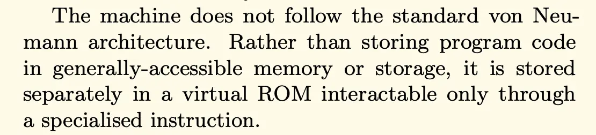

如果我们看一下以太坊黄皮书的这段摘录，我们可以看到合约的字节码存储在单独的虚拟 ROM（只读存储器）中。这给我们带来了合约代码的一个重要特性：代码是不可变的。

这意味着一旦部署了合约，合约代码就无法修改。其指令数据存储在代码中（构成智能合约逻辑的操作码），是持久的，并且如上所述，是帐户状态字段的一部分。

合约一旦部署，其代码就无法更改。因此，存储在代码中的数据和变量是只读的，不可编辑。

在合约字节码中存储变量可以节省 gas。从合约字节码访问这些变量既便宜又高效。

## 与代码相关的操作码

**合约的字节码相关的操作码有四个：**

- `CODESIZE`
- `CODECOPY`
- `EXTCODESIZE`
- `EXTCODECOPY`

操作码 `CODESIZE` 使 `CODECOPY` 您能够读取和复制我们当前正在执行的合约的字节码。

最后，`EXTCODESIZE` 使 `EXTCODECOPY` 您能够从一个合约中读取和复制另一个外部合约的字节码，并提供其地址。

# 代码布局

> **注意**_：请参阅 OpenZeppelin 的文章系列__“解构 Solidity 合约”__，以深入了解合约字节码的布局。_

代码由字节组成（与存储不同，存储由槽(slot)组成的）。在智能合约的字节码中，没有“槽”的概念。合约字节码中存储的变量，例如 `constant` 或 `immutable` 编译器将它们放置在代码中的任何位置。

代码始终是 32 字节的倍数。请参阅 zkSync 中 L1ERC20Bridge 使用的 L2ContractHelper。

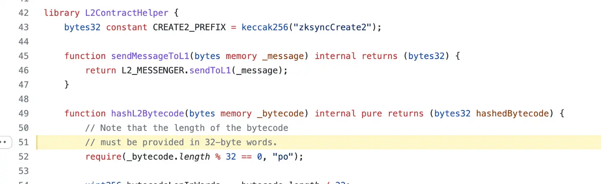

> [Solidity 库合约 L2ContractHelper 来自 GitHub 上的 zkSync](https://github.com/matter-labs/v2-testnet-contracts/blob/d0a4db223ddb5736d5608cb87eab14ab49fe56c1/l1/contracts/common/L2ContractHelper.sol#L51)

智能合约的运行时字节码可以分为三个主要部分：

- **调度器(dispatcher)：** 也称为"枢纽(hub)"，旨在通过分析 calldata 并将其与函数选择器进行比较来找到智能合约。
- **函数包装器**：旨在解包/拆包函数参数，并包装由函数体返回的值。
- **函数主体：** 包含 Solidity 函数的主要逻辑。


除了这三个主要部分之外，智能合约的字节码还包括三个较小的部分：

- 自由空闲指针
- Calldata 检查：确保我们至少发送了四个字节函数选择器。如果没有，它将使用 `receive`/`fallback` 函数作为默认函数处理程序。
- 合约元数据

我们将研究调度器的工作原理，因为它是任何智能合约字节码中的主要通用组件之一（每个合约的其余字节码都是独特的，因为它取决于 Solidity 合约的内部逻辑）。

## 调度器（dispatcher）

您是否想过，您的智能合约如何知道在接收调用数据时要执行哪个外部/公共函数？

正如我们所见，合约的 EVM 字节码结构本身包含大量数据，即使是它发出的一个小的 `Ownable` 合约。

其中很小但很重要的一个部分是调度器。让我们以一个 `Ownable` 合约为例，看看调度器如何工作。以下是代码：

```
pragma solidity >=0.7.0 <0.9.0;

contract Ownable {
    address private owner;

    // event for EVM logging
    event OwnerSet(address indexed oldOwner, address indexed newOwner);

    // modifier to check if caller is owner
    modifier isOwner() {
        require(msg.sender == owner, "Caller is not owner");
        _;
    }

    /**
     * @dev Set contract deployer as owner
     */
    constructor() {
        owner = msg.sender; // 'msg.sender' is sender of current call, contract deployer for a constructor
        emit OwnerSet(address(0), owner);
    }

    /**
     * @dev Change owner
     * @param _newOwner address of new owner
     */
    function updateOwner(address _newOwner) external isOwner {
        emit OwnerSet(owner, _newOwner);
        owner = _newOwner;
    }

    /**
     * @dev Return owner address
     * @return address of owner
     */
    function getOwner() external view returns (address) {
        return owner;
    }
}
```

为了解释什么是调度器以及它是如何工作的，让我们看一下上面的 Solidity 代码。我们的 `Ownable` 合约包含两个外部函数：

- `updateOwner(address newOwner)` => 四字节的函数签名 = `0x880cdc31`.
- `getOwner()` => 四字节的函数签名 = `0x893d20e8`。

如果你用 `solc` 命令为这个合约生成运行时字节码，它看起来会是这样的。

`solc — bin-runtime Ownable.sol`

您将在 CLI 中获得以下运行时字节码作为输出：

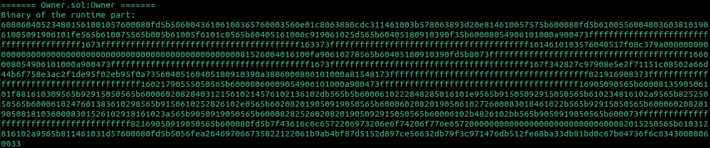

这个字节码包含一堆看起来毫无意义的十六进制代码，如果我们将其反汇编成表示操作码的形式，那么它会更有意义。生成它的反汇编，我们得到了合约字节码的所有操作码表示，如下所示：

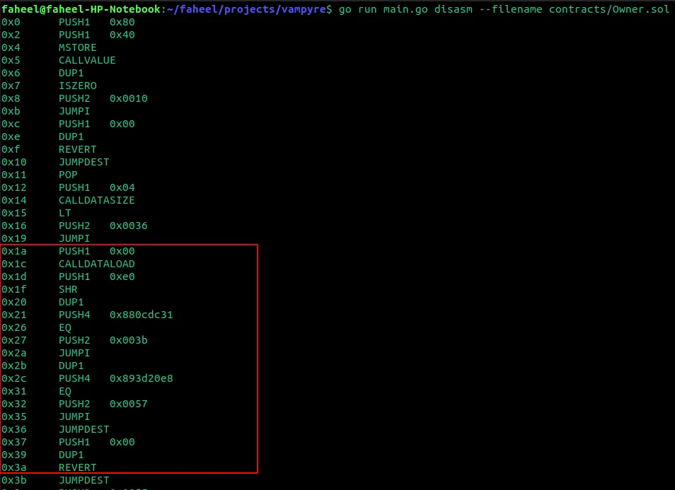

整个反汇编内容相当庞大，但我希望你专注于红框内的操作码：这个红框代表了我们字节码中的调度器。

那么，什么是调度器？调度器是运行时字节码的一部分，它检查用户请求执行的函数是否存在于智能合约中。其存在性是通过函数选择器来检查的。

- 如果存在性检查通过（意味着函数存在于合约中），它将跳转到函数体执行其逻辑。
- 如果未找到函数存在性，则执行智能合约的 `fallback` 函数，或者如果合约不包含 `fallback` 函数，则回滚 `revert`。

那么，调度器是如何工作的？调度器如何找到要执行的函数？

让我们再仔细看一下我们的反汇编代码。如果用户想执行我们合约的 `getOwner` 函数，calldata 将会是 `0x893d20e8…`。

我们的调度器包含了所有函数签名。如果你看一下下面调度器中的位置 `0x21` 和 `0x2c`，它们分别是 `updateOwner(address newOwner)` 和 `getOwner()` 的函数签名。

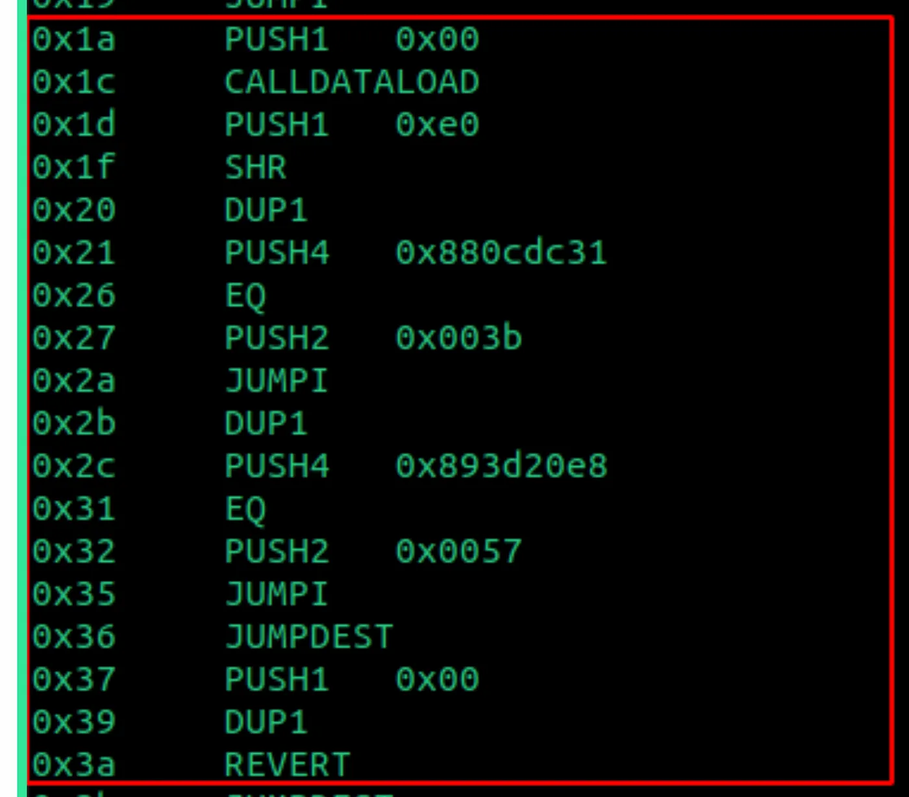

根据反汇编，调度器将开始使用 `EQ` 操作码将我们的 calldata 与其中所有函数签名进行比较。

- 如果它与位置 `0x21` 的函数签名相匹配，它将跳到字节码中 `0x003b` 的位置，执行 `updateOwner(address newOwner)` 的逻辑。
- 如果它与位置 `0x2c` 的函数签名匹配，它将跳转到字节码中的位置 `0x0057`，执行 `getOwner()` 的逻辑。
- 如果它无法匹配调度程序中定义的任何函数签名，它将 `revert`，如位置 0x3a 所示。

在我们的例子中，由于我们想执行调度器中定义的 `getOwner` 函数，它将跳转到字节码中的位置 0x0057 并执行那里的任何逻辑。

你可以想象调度器就像是在许多编程语言中使用的 switch case 语句。switch case 语句是如何工作的？它会接收“switch”中的数据，然后检查它是否与定义的任何“case”匹配。类似地，我们可以编写一些伪代码来描述调度器可能的外观。下面是一个示例：

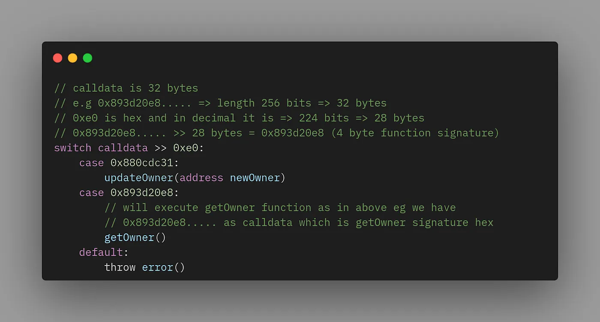

# 智能合约的代码存储在哪里？

代码作为一个数据位置是指合约的字节码，所以你可能想知道这个（字节）代码存储在哪里。

> 合约代码存储在 EVM 的哪里？

这是一个复杂的问题，需要指南来解决。正如我们将看到的低层，访问特定地址下的智能合约字节码的路径需要经过多个步骤。但让我们先回顾一下。

其中，存储（下图绿色）和代码（下图紫色）是与实际智能合约直接相关的两个数据位置（而内存或 calldata 与 EVM 执行环境有关的）。

指令数据是合约账户状态字段的一部分。如果我们再看一下下面的 EVM 架构图，我们可以想象账户状态（每个以太坊地址下的状态）、合约字节码和合约的存储之间存在直接联系。

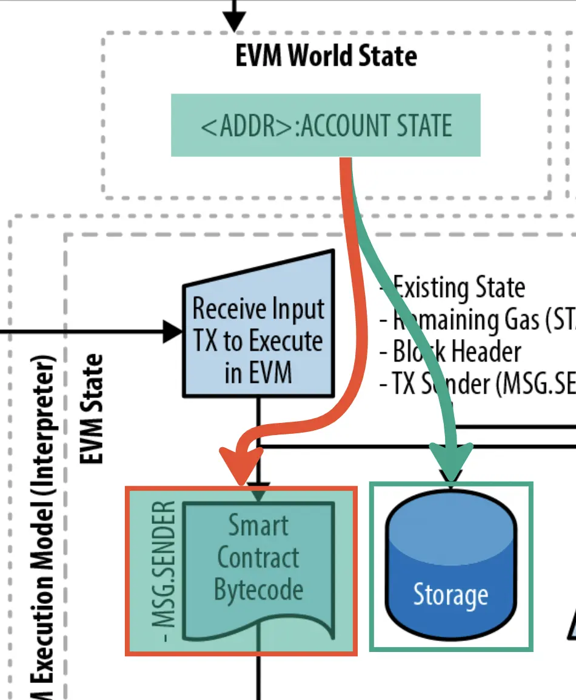

因此，对于“智能合约的字节码存储/位于哪里，以及如何访问？”这个问题的答案很简单，智能合约的字节码存储在账户状态下，在智能合约的地址状态下。

但是，有一个细微差别！智能合约的字节码并不直接存储在账户状态下。相反，它是 `codeHash` 存储的。

因此，我们要了解合约的字节码存储在哪里，接下来的问题是：

1. codeHash 是什么？
2. 智能合约的字节码位于何处？
3. 为什么我们要对智能合约的字节码进行哈希处理？
4. 为什么我们将智能合约字节码的哈希值存储在账户状态中，而不是直接存储字节码本身？

回答第一个问题，codeHash 简单来说就是智能合约字节码的 keccak256 哈希值。

回答第二个问题，让我们看一下这个图表。它们来自于更详细的 EVM 架构图 + 黄皮书。

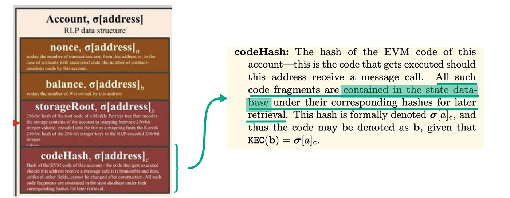

正如我们从上面的图片中可以看到的那样，账户状态只存储哈希值。无论是对于合约存储还是合约的字节码都是如此。因此，如果我们只存储合约字节码的哈希值，那么实际的合约字节码存储在哪里呢？

如上所示，黄皮书指出：

> 所有这些（合约的）代码片段都包含在状态数据库中的相应哈希值下。

这里的“状态数据库”是什么意思？

每个以太坊客户端（如 Geth、Nethermind 等）都在底层使用一个底层数据库（Geth 为 leveldb，Nethermind 为 rocksdb）。这个基本的底层数据库软件使您可以将数据存储为基本的键值对。数据可以存储在特定的键下。

因此，智能合约的字节码存储在以太坊客户端的底层数据库中，在合约字节码的 keccak256 哈希值对应的字段下。

最后，是时候回答最后的问题 3 和 4。为什么我们要存储合约字节码的哈希值而不是直接存储合约的字节码？

使用 `codeHash` 而不是代码的唯一原因是为了性能和优化：

- 出于性能原因

当智能合约的 `nonce`、`balance` 或 `storageRoot` 发生变化时，我们需要将合约账户状态的四个元素重新哈希在一起（`nonce `+ `balance `+ `storageRoot `+ `codeHash`）即可获得该账户的根。

如果我们使用代码而不是 `codeHash`，我们将不得不再次对所有这些字段进行哈希计算，这将导致计算成本大大增加，而只是使用 `codeHash`，永远不会改变。

- 为了优化以节省底层数据库的空间

当多个智能合约具有相同的代码/字节码（例如，10 个智能合约在 10 个不同的地址上部署），我们可以只在每个智能合约地址下保存一次字节码，而不是在每个地址下保存相同的字节码十次。这样可以避免多次存储相同的数据，并减少以太坊客户端低级别数据库使用的磁盘空间。

# 创建代码与运行时代码

> **注意：**_你会发现网上说的“代码”和“字节码”是可以互换使用的。所以：_
> _→ “创建代码”或“创建字节码”指的是同一件事。_
> _→ “运行时代码”或“运行时字节码”指的是同一件事。_

然而，当你深入了解以太坊、EVM 上的智能合约以及此类合约如何部署在以太坊区块链上时，你会注意到有两个不同的概念。

# 智能合约的代码有两种，如下所示：

- 创建代码：这是合约的字节码，其中包含部署合约和运行逻辑的指令 `constructor`。
- 运行时代码：这是合约在区块链上部署后的最终字节码。

主要区别在于，创建代码仅在部署合约时运行一次。相比之下，合约运行时代码是合约在网络上的字节码，在调用合约后执行。运行时代码是外部调用触发合约后由 EVM 运行的代码。

> **注意：**_您还会在网上找到描述创建或运行时代码的替代术语。_
> _→ “初始化代码” = 创建代码_
> _→ “部署的字节码” = 运行时代码_

让我们更仔细地看看创建和运行时代码。

## 创建代码

创建字节码相当于创建合约的交易的输入数据，前提是交易的唯一目的是创建合约。

创建代码包括 `constructor` 逻辑及其参数。

但是关于创建代码，最重要的事情之一是理解：

> 创建代码是生成运行时字节码的代码。

创建代码不仅包含运行构造函数的逻辑，还包含返回合约运行时代码并将该字节码保存在区块链上部署的智能合约地址下的逻辑。这就是为什么它被称为“创建”代码。

在下一节中，我们将在一分钟内看到这是如何执行的。让我们首先看一下运行时代码和其他差异。

## 运行时代码

智能合约的运行时代码是存储在链上的智能合约字节码，存储在部署的智能合约地址下。

当您在区块链上与智能合约交互时，运行时代码是通过外部调用（来自 EOAs 或其他智能合约）时运行的代码。

与创建代码不同，运行时代码不包括构造函数的逻辑。这是因为构造函数只在合约部署时运行一次，因此翻译构造函数逻辑的 EVM 字节码指令只在创建时关联。

## 创建代码与运行时代码——查看工件的差异

让我们看一个具体的例子，以直观地区分智能合约的创建和运行时代码。

通常，创建代码比运行时代码更大（包含更多字节），因为它包含逻辑 `constructor`+ 返回和保存合约字节码的逻辑。

我们来看以下 Solidity 智能合约的示例：

```
// SPDX-License-Identifier: Apache-2.0
pragma solidity ^0.8.0;

contract MyContract {
    string internal _myName;

    constructor(string memory initialName) {
        _myName = initialName;
    }

    function setName(string memory name) public {
        _myName = name;
    }

    function getName() public view returns (string memory) {
        return _myName;
    }
}
```

如果我们比较创建代码和运行时代码，我们可以看到创建代码比运行时代码更大，包含的字节数也更多。这是因为创建代码（如前所述）包含以下内容：

- 我们合约 `constructor` 的逻辑（在我们的例子中，将状态变量设置 `_myName` 为 `initialName`）。
- 返回并保存区块链上智能合约的运行时字节码的逻辑（下一节将对此进行更多介绍）。

**请参阅下面的区别。我用粗体突出显示了与这两个部分相关的字节码。**

> **Note:** the creation and bytecode of this contract was compiled using `solc` version 0.8.15 with the optimiser on and the number of runs set to 1,000.

```
Creation Code
0x**608060405234801561001057600080fd5b5060405161062938038061062983398101604081905261002f91610058565b600061003b82826101b0565b505061026f565b634e487b7160e01b600052604160045260246000fd5b6000602080838503121561006b57600080fd5b82516001600160401b038082111561008257600080fd5b818501915085601f83011261009657600080fd5b8151818111156100a8576100a8610042565b604051601f8201601f19908116603f011681019083821181831017156100d0576100d0610042565b8160405282815288868487010111156100e857600080fd5b600093505b8284101561010a57848401860151818501870152928501926100ed565b8284111561011b5760008684830101525b98975050505050505050565b600181811c9082168061013b57607f821691505b60208210810361015b57634e487b7160e01b600052602260045260246000fd5b50919050565b601f8211156101ab57600081815260208120601f850160051c810160208610156101885750805b601f850160051c820191505b818110156101a757828155600101610194565b5050505b505050565b81516001600160401b038111156101c9576101c9610042565b6101dd816101d78454610127565b84610161565b602080601f83116001811461021257600084156101fa5750858301515b600019600386901b1c1916600185901b1785556101a7565b600085815260208120601f198616915b8281101561024157888601518255948401946001909101908401610222565b508582101561025f5787850151600019600388901b60f8161c191681555b5050505050600190811b01905550565b6103ab8061027e6000396000f3fe**608060405234801561001057600080fd5b50600436106100365760003560e01c806317d7de7c1461003b578063c47f002714610059575b600080fd5b61004361006e565b6040516100509190610110565b60405180910390f35b61006c61006736600461017b565b610100565b005b60606000805461007d9061022c565b80601f01602080910402602001604051908101604052809291908181526020018280546100a99061022c565b80156100f65780601f106100cb576101008083540402835291602001916100f6565b820191906000526020600020905b8154815290600101906020018083116100d957829003601f168201915b5050505050905090565b600061010c82826102b5565b5050565b600060208083528351808285015260005b8181101561013d57858101830151858201604001528201610121565b8181111561014f576000604083870101525b50601f01601f1916929092016040019392505050565b634e487b7160e01b600052604160045260246000fd5b60006020828403121561018d57600080fd5b813567ffffffffffffffff808211156101a557600080fd5b818401915084601f8301126101b957600080fd5b8135818111156101cb576101cb610165565b604051601f8201601f19908116603f011681019083821181831017156101f3576101f3610165565b8160405282815287602084870101111561020c57600080fd5b826020860160208301376000928101602001929092525095945050505050565b600181811c9082168061024057607f821691505b60208210810361026057634e487b7160e01b600052602260045260246000fd5b50919050565b601f8211156102b057600081815260208120601f850160051c8101602086101561028d5750805b601f850160051c820191505b818110156102ac57828155600101610299565b5050505b505050565b815167ffffffffffffffff8111156102cf576102cf610165565b6102e3816102dd845461022c565b84610266565b602080601f83116001811461031857600084156103005750858301515b600019600386901b1c1916600185901b1785556102ac565b600085815260208120601f198616915b8281101561034757888601518255948401946001909101908401610328565b50858210156103655787850151600019600388901b60f8161c191681555b5050505050600190811b0190555056fea26469706673582212201ce19d00816f93d51e8ec603d254f721cc52796da195e52fe2ba6c928e980e3264736f6c634300080f0033",

Runtime Code
0x608060405234801561001057600080fd5b50600436106100365760003560e01c806317d7de7c1461003b578063c47f002714610059575b600080fd5b61004361006e565b6040516100509190610110565b60405180910390f35b61006c61006736600461017b565b610100565b005b60606000805461007d9061022c565b80601f01602080910402602001604051908101604052809291908181526020018280546100a99061022c565b80156100f65780601f106100cb576101008083540402835291602001916100f6565b820191906000526020600020905b8154815290600101906020018083116100d957829003601f168201915b5050505050905090565b600061010c82826102b5565b5050565b600060208083528351808285015260005b8181101561013d57858101830151858201604001528201610121565b8181111561014f576000604083870101525b50601f01601f1916929092016040019392505050565b634e487b7160e01b600052604160045260246000fd5b60006020828403121561018d57600080fd5b813567ffffffffffffffff808211156101a557600080fd5b818401915084601f8301126101b957600080fd5b8135818111156101cb576101cb610165565b604051601f8201601f19908116603f011681019083821181831017156101f3576101f3610165565b8160405282815287602084870101111561020c57600080fd5b826020860160208301376000928101602001929092525095945050505050565b600181811c9082168061024057607f821691505b60208210810361026057634e487b7160e01b600052602260045260246000fd5b50919050565b601f8211156102b057600081815260208120601f850160051c8101602086101561028d5750805b601f850160051c820191505b818110156102ac57828155600101610299565b5050505b505050565b815167ffffffffffffffff8111156102cf576102cf610165565b6102e3816102dd845461022c565b84610266565b602080601f83116001811461031857600084156103005750858301515b600019600386901b1c1916600185901b1785556102ac565b600085815260208120601f198616915b8281101561034757888601518255948401946001909101908401610328565b50858210156103655787850151600019600388901b60f8161c191681555b5050505050600190811b0190555056fea26469706673582212201ce19d00816f93d51e8ec603d254f721cc52796da195e52fe2ba6c928e980e3264736f6c634300080f0033
```

## 关于生成的创建/运行时代码的说明

请注意，生成的创建和运行时代码会因多种因素而有所不同，其中包括：

- 用于编译 Solidity 智能合约的 solc 编译器的版本
- 如果 solc 编译器的优化器设置为 ON 或 OFF。
- 如果优化器处于开启状态，则优化器的配置（例如，运行次数）。
- `constructor` 合约部署时提供的参数。

# 合约（运行时）代码是如何生成的

我们现在已经看到了智能合约的两种代码类型：创建代码和运行时代码。

但是任何 Solidity 开发人员都会遇到的一个主要问题是：“智能合约的代码是如何创建的？”

要理解这个概念，我们需要了解创建代码和运行时代码之间的关系。之前，我们看到“创建代码是生成运行时代码的代码”。

因此，第一步是了解创建代码中发生的情况。

我们将通过部署一个智能合约并调试部署交易来了解这一概念。但首先，我们将看看在没有构造函数的情况下创建代码与运行时代码之间的区别！

当我们部署一个不包含构造函数的合约时，创建代码仍然比运行时代码大。这意味着在部署合约时仍然会发生一些事情，而不仅仅是构造函数逻辑。

它们是什么？理解这些指令是理解 EVM 如何部署合约，以及回答上述问题“创建代码是如何从运行时代码生成”的关键。

让我们再次看看稍作修改的前面我们的 `MyContract` 示例的创建代码。但这次没有初始化状态变量 `myName` 的构造函数的情况。

> 注意：此合约的创建和字节码是使用 solc 版本 0.8.15 编译的，优化器打开，并将运行次数设置为 1,000。

```
// SPDX-License-Identifier: Apache-2.0pragma solidity ^0.8.0;

contract MyContract {
    string internal _myName;

    function setName(string memory name) public {
        _myName = name;
    }

    function getName() public view returns (string memory) {
        return _myName;
    }
}
```

```
Creation Code
0x**608060405234801561001057600080fd5b506103ab806100206000396000f3fe**608060405234801561001057600080fd5b50600436106100365760003560e01c806317d7de7c1461003b578063c47f002714610059575b600080fd5b61004361006e565b6040516100509190610110565b60405180910390f35b61006c61006736600461017b565b610100565b005b60606000805461007d9061022c565b80601f01602080910402602001604051908101604052809291908181526020018280546100a99061022c565b80156100f65780601f106100cb576101008083540402835291602001916100f6565b820191906000526020600020905b8154815290600101906020018083116100d957829003601f168201915b5050505050905090565b600061010c82826102b5565b5050565b600060208083528351808285015260005b8181101561013d57858101830151858201604001528201610121565b8181111561014f576000604083870101525b50601f01601f1916929092016040019392505050565b634e487b7160e01b600052604160045260246000fd5b60006020828403121561018d57600080fd5b813567ffffffffffffffff808211156101a557600080fd5b818401915084601f8301126101b957600080fd5b8135818111156101cb576101cb610165565b604051601f8201601f19908116603f011681019083821181831017156101f3576101f3610165565b8160405282815287602084870101111561020c57600080fd5b826020860160208301376000928101602001929092525095945050505050565b600181811c9082168061024057607f821691505b60208210810361026057634e487b7160e01b600052602260045260246000fd5b50919050565b601f8211156102b057600081815260208120601f850160051c8101602086101561028d5750805b601f850160051c820191505b818110156102ac57828155600101610299565b5050505b505050565b815167ffffffffffffffff8111156102cf576102cf610165565b6102e3816102dd845461022c565b84610266565b602080601f83116001811461031857600084156103005750858301515b600019600386901b1c1916600185901b1785556102ac565b600085815260208120601f198616915b8281101561034757888601518255948401946001909101908401610328565b50858210156103655787850151600019600388901b60f8161c191681555b5050505050600190811b0190555056fea2646970667358221220544b267a97e844606584e76ce3c83ab212d24fbb9597f62847f2213b26b2e3c064736f6c634300080f0033

Runtime Code
0x608060405234801561001057600080fd5b50600436106100365760003560e01c806317d7de7c1461003b578063c47f002714610059575b600080fd5b61004361006e565b6040516100509190610110565b60405180910390f35b61006c61006736600461017b565b610100565b005b60606000805461007d9061022c565b80601f01602080910402602001604051908101604052809291908181526020018280546100a99061022c565b80156100f65780601f106100cb576101008083540402835291602001916100f6565b820191906000526020600020905b8154815290600101906020018083116100d957829003601f168201915b5050505050905090565b600061010c82826102b5565b5050565b600060208083528351808285015260005b8181101561013d57858101830151858201604001528201610121565b8181111561014f576000604083870101525b50601f01601f1916929092016040019392505050565b634e487b7160e01b600052604160045260246000fd5b60006020828403121561018d57600080fd5b813567ffffffffffffffff808211156101a557600080fd5b818401915084601f8301126101b957600080fd5b8135818111156101cb576101cb610165565b604051601f8201601f19908116603f011681019083821181831017156101f3576101f3610165565b8160405282815287602084870101111561020c57600080fd5b826020860160208301376000928101602001929092525095945050505050565b600181811c9082168061024057607f821691505b60208210810361026057634e487b7160e01b600052602260045260246000fd5b50919050565b601f8211156102b057600081815260208120601f850160051c8101602086101561028d5750805b601f850160051c820191505b818110156102ac57828155600101610299565b5050505b505050565b815167ffffffffffffffff8111156102cf576102cf610165565b6102e3816102dd845461022c565b84610266565b602080601f83116001811461031857600084156103005750858301515b600019600386901b1c1916600185901b1785556102ac565b600085815260208120601f198616915b8281101561034757888601518255948401946001909101908401610328565b50858210156103655787850151600019600388901b60f8161c191681555b5050505050600190811b0190555056fea2646970667358221220544b267a97e844606584e76ce3c83ab212d24fbb9597f62847f2213b26b2e3c064736f6c634300080f0033
```

我们这次可以看到创建代码比以前小了。它只比运行时代码多了一些指令，上面用**粗体**标记。查看这种明显差异的一个很好的方法如下：

1. 使用鼠标选择上面的运行时代码，带有前缀 `0x`。
2. 复制剪贴板中的运行时代码：`CTRL`/ `CMD`+ `C`。
3. 使用快捷键 `CTRL/CMD + F` 打开您的网络浏览器中的搜索功能。
4. 将运行时代码粘贴到搜索输入字段中。

这就是应该出现的图片。

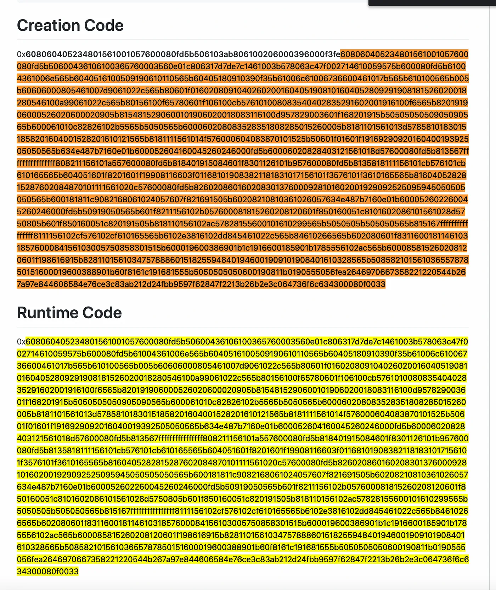

可以看到，创建代码开头还有 32 个字节。

`0x608060405234801561001057600080fd5b506103ab806100206000396000f3fe`

那么，这些是什么？它们是做什么的？如果我们将这个字节码传递到 evm.codes 的 Playground 中，我们会得到以下一系列操作码：

```
[00] PUSH1 80
[02] PUSH1 40
[04] MSTORE      ; free memory pointer

[05] CALLVALUE   ; retrieve the value (msg.value) sent while deploying
[06] DUP1        ; since the constructor is non-payable, check that
[07] ISZERO      ; we did not send any value when deploying the contract
                    
[08] PUSH2 0010  ; if we did not send any value, all good we continue
[0b] JUMPI       ; deploying the contract jump at instruction nb 0x010

[0c] PUSH1 00    ; if we sent a value to the non payable constructor,
[0e] DUP1        ; this is invalid,
[0f] REVERT      ; so we revert

[10] JUMPDEST    ; <== this is the jump destination defined at instruction [05]
[11] POP         ; start fresh with an empty stack

                 ; -----------------------------------------------------------

[12] PUSH2 03ab  ; the runtime code is 939 bytes long 
                 ; (0x03ab in hex = 939 in decimals)
[15] DUP1        ; param 1 = number of bytes in the contract's code to copy 
                 ;           (939 bytes). Wee duplicate the previous number)
[16] PUSH2 0020  ; param 2 = offset in the contract code to start copying from
[19] PUSH1 00    ; param 3 = destination offset in memory
[1b] CODECOPY    ; the opcode `CODECOPY` consumes the three parameters above
                 ; in plain words, it will copy 939 bytes starting from
                 ; offset 0 in the contract code (= the entire contract bytcode)
                 ; and copy at the offset 0 in memory

[1c] PUSH1 00    ; push the starting offset in memory to return from (0)
[1e] RETURN      ; return 939 bytes from memory 

[1f] INVALID
```

## `isContract()` 和 `EXTCODESIZE` 的注意事项

isContract() 函数是 OpenZeppelin 库中最受欢迎的函数之一。它旨在检查作为参数传递的给定地址是外部拥有账户（EOA）还是合约。

该函数检查是否在该地址下存储了一些代码。

在 OpenZeppelin 库的版本 4.4.2 之前，isContract() 函数使用 extcodesize 操作码来执行此检查。

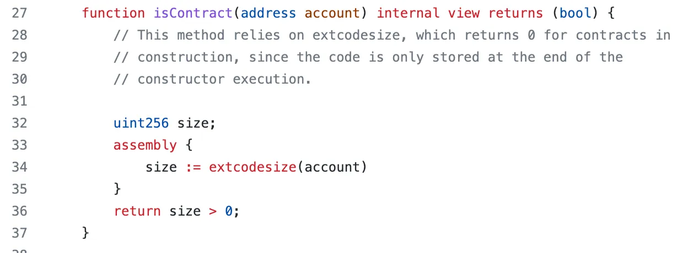

从版本 4.5.0 开始，内置的 Solidity 方法已经替换了汇编块 address.code 来执行相同的检查。

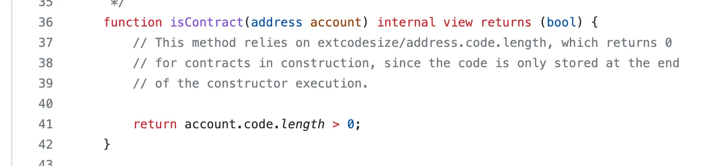

但是 isContract() 函数体内的注释提供了一些提示，表明该函数包含一些限制和漏洞。让我们来看看。

`isContract` 提出了很多安全考虑。

检查地址处是否存在代码并不一定意味着它不是智能合约，因为存在以下情况：

- 该函数可能是从合约的构造函数中调用的。
- 如果被检查的地址已经预先确定，并且合约尚未部署（使用 `create2`）。

因此，总而言之，该 `isContract()` 功能可以简单归结为：

- 如果要检查的地址下存储了一些代码（code.length > 0），则可以安全地假设该地址是一个智能合约。
- 如果要检查的地址下没有存储任何代码，我们无法做出假设并确信它不是一个智能合约。

这是一个有点棘手的学习主题，但它对于智能合约安全的基础至关重要。

# 在 Solidity 中访问合约代码

# Solidity 有多种方法来访问智能合约的字节码。

- `<address>.codehash`
- `<address>.code`
- `type(ContractName).creationCode`
- `type(ContractName).runtimeCode`

`.code`、`.creationCode` 和 `.runtimeCode` 共同之处在于它们返回一个 `bytes memory` 值。

这些神奇属性之间的主要区别在于它们是两种 Solidity 类型的成员。`.code` 和 `.codehash` 属于地址类型的成员，而 `.creationCode` 和 `.runtimeCode` 则属于合约类型的成员。

另一个区分这些属性的特点是，`.code` 和 `.codehash` 是从区块链上读取的属性，而 `.creationCode` 和 `.runtimeCode` 实际上返回的是一些内联在智能合约字节码中的 `bytes memory`。
