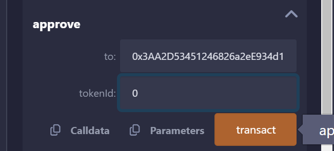

`Opensea` 是以太坊上最大的 `NFT` 交易平台，总交易总量达到了 `$300亿`。`Opensea` 在交易中抽成 `2.5%`，因此它通过用户交易至少获利了 `$7.5亿`。另外，它的运作并不去中心化，且不准备发币补偿用户。`NFT` 玩家苦 `Opensea` 久已，今天我们就利用智能合约搭建一个零手续费的去中心化 `NFT` 交易所：`NFTSwap`。

## **设计逻辑**

- 卖家：出售 `NFT` 的一方，可以挂单 `list`、撤单 `revoke`、修改价格 `update`。
- 买家：购买 `NFT` 的一方，可以购买 `purchase`。
- 订单：卖家发布的 `NFT` 链上订单，一个系列的同一 `tokenId` 最多存在一个订单，其中包含挂单价格 `price` 和持有人 `owner` 信息。当一个订单交易完成或被撤单后，其中信息清零。

## NFTSwap合约

### **事件**

合约包含 `4` 个事件，对应挂单 `list`、撤单 `revoke`、修改价格 `update`、购买 `purchase` 这四个行为：

```
event List(address indexed seller, address indexed nftAddr, uint256 indexed tokenId, uint256 price);
    event Purchase(address indexed buyer, address indexed nftAddr, uint256 indexed tokenId, uint256 price);
    event Revoke(address indexed seller, address indexed nftAddr, uint256 indexed tokenId);    
    event Update(address indexed seller, address indexed nftAddr, uint256 indexed tokenId, uint256 newPrice);
```

### **订单**

`NFT` 订单抽象为 `Order` 结构体，包含挂单价格 `price` 和持有人 `owner` 信息。`nftList` 映射记录了订单是对应的 `NFT` 系列（合约地址）和 `tokenId` 信息。

```
// 定义order结构体
    struct Order{
        address owner;
        uint256 price; 
    }
    // NFT Order映射
    mapping(address => mapping(uint256 => Order)) public nftList;
```

### **回退函数**

在 `NFTSwap` 中，用户使用 `ETH` 购买 `NFT`。因此，合约需要实现 `fallback()` 函数来接收 `ETH`。

```
fallback() external payable{}
```

### **onERC721Received**

`ERC721` 的安全转账函数会检查接收合约是否实现了 `onERC721Received()` 函数，并返回正确的选择器 `selector`。用户下单之后，需要将 `NFT` 发送给 `NFTSwap` 合约。因此 `NFTSwap` 继承 `IERC721Receiver` 接口，并实现 `onERC721Received()` 函数：

```
contract NFTSwap is IERC721Receiver{

    // 实现{IERC721Receiver}的onERC721Received，能够接收ERC721代币
    function onERC721Received(
        address operator,
        address from,
        uint tokenId,
        bytes calldata data
    ) external override returns (bytes4){
        return IERC721Receiver.onERC721Received.selector;
    }
```

### **交易**

合约实现了 `4` 个交易相关的函数：

- 挂单 `list()`：卖家创建 `NFT` 并创建订单，并释放 `List` 事件。参数为 `NFT` 合约地址 `_nftAddr`，`NFT` 对应的 `_tokenId`，挂单价格 `_price`（**注意：单位是wei**）。成功后，`NFT` 会从卖家转到 `NFTSwap` 合约中。

```
// 挂单: 卖家上架NFT，合约地址为_nftAddr，tokenId为_tokenId，价格_price为以太坊（单位是wei）
    function list(address _nftAddr, uint256 _tokenId, uint256 _price) public{
        IERC721 _nft = IERC721(_nftAddr); // 声明IERC721接口合约变量
        require(_nft.getApproved(_tokenId) == address(this), "Need Approval"); // 合约得到授权
        require(_price > 0); // 价格大于0

        Order storage _order = nftList[_nftAddr][_tokenId]; //设置NF持有人和价格
        _order.owner = msg.sender;
        _order.price = _price;
        // 将NFT转账到合约
        _nft.safeTransferFrom(msg.sender, address(this), _tokenId);

        // 释放List事件
        emit List(msg.sender, _nftAddr, _tokenId, _price);
    }
```

- 撤单 `revoke()`：卖家撤回挂单，并释放 `Revoke` 事件。参数为 `NFT` 合约地址 `_nftAddr`，`NFT` 对应的 `_tokenId`。成功后，`NFT` 会从 `NFTSwap` 合约转回卖家。

```
// 撤单： 卖家取消挂单
    function revoke(address _nftAddr, uint256 _tokenId) public {
        Order storage _order = nftList[_nftAddr][_tokenId]; // 取得Order        
        require(_order.owner == msg.sender, "Not Owner"); // 必须由持有人发起
        // 声明IERC721接口合约变量
        IERC721 _nft = IERC721(_nftAddr);
        require(_nft.ownerOf(_tokenId) == address(this), "Invalid Order"); // NFT在合约中
        
        // 将NFT转给卖家
        _nft.safeTransferFrom(address(this), msg.sender, _tokenId);
        delete nftList[_nftAddr][_tokenId]; // 删除order
      
        // 释放Revoke事件
        emit Revoke(msg.sender, _nftAddr, _tokenId);
    }
```

- 修改价格 `update()`：卖家修改 `NFT` 订单价格，并释放 `Update` 事件。参数为 `NFT` 合约地址 `_nftAddr`，`NFT` 对应的 `_tokenId`，更新后的挂单价格 `_newPrice`（**注意：单位是wei**）。

```
// 调整价格: 卖家调整挂单价格
    function update(address _nftAddr, uint256 _tokenId, uint256 _newPrice) public {
        require(_newPrice > 0, "Invalid Price"); // NFT价格大于0
        Order storage _order = nftList[_nftAddr][_tokenId]; // 取得Order        
        require(_order.owner == msg.sender, "Not Owner"); // 必须由持有人发起
        // 声明IERC721接口合约变量
        IERC721 _nft = IERC721(_nftAddr);
        require(_nft.ownerOf(_tokenId) == address(this), "Invalid Order"); // NFT在合约中
        
        // 调整NFT价格
        _order.price = _newPrice;
      
        // 释放Update事件
        emit Update(msg.sender, _nftAddr, _tokenId, _newPrice);
    }
```

- 购买 `purchase`：买家支付 `ETH` 购买挂单的 `NFT`，并释放 `Purchase` 事件。参数为 `NFT` 合约地址 `_nftAddr`，`NFT` 对应的 `_tokenId`。成功后，`ETH` 将转给卖家，`NFT` 将从 `NFTSwap` 合约转给买家。

```
// 购买: 买家购买NFT，合约为_nftAddr，tokenId为_tokenId，调用函数时要附带ETH
    function purchase(address _nftAddr, uint256 _tokenId) payable public {
        Order storage _order = nftList[_nftAddr][_tokenId]; // 取得Order        
        require(_order.price > 0, "Invalid Price"); // NFT价格大于0
        require(msg.value >= _order.price, "Increase price"); // 购买价格大于标价
        // 声明IERC721接口合约变量
        IERC721 _nft = IERC721(_nftAddr);
        require(_nft.ownerOf(_tokenId) == address(this), "Invalid Order"); // NFT在合约中

        // 将NFT转给买家
        _nft.safeTransferFrom(address(this), msg.sender, _tokenId);
        // 将ETH转给卖家，多余ETH给买家退款
        payable(_order.owner).transfer(_order.price);
        payable(msg.sender).transfer(msg.value-_order.price);

        delete nftList[_nftAddr][_tokenId]; // 删除order

        // 释放Purchase事件
        emit Purchase(msg.sender, _nftAddr, _tokenId, _order.price);
    }
```

## **Remix实现**

1. **部署 NFT 合约**

部署 `RCCApe` NFT 合约。

```
//ERC721.sol
/ SPDX-License-Identifier: MIT
// by tian
pragma solidity ^0.8.21;

import "./IERC165.sol";
import "./IERC721.sol";
import "./IERC721Receiver.sol";
import "./IERC721Metadata.sol";
import "./String.sol";

contract ERC721 is IERC721, IERC721Metadata{
    using Strings for uint256; // 使用String库，

    // Token名称
    string public override name;
    // Token代号
    string public override symbol;
    // tokenId 到 owner address 的持有人映射
    mapping(uint => address) private _owners;
    // address 到 持仓数量 的持仓量映射
    mapping(address => uint) private _balances;
    // tokenID 到 授权地址 的授权映射
    mapping(uint => address) private _tokenApprovals;
    //  owner地址。到operator地址 的批量授权映射
    mapping(address => mapping(address => bool)) private _operatorApprovals;

    // 错误 无效的接收者
    error ERC721InvalidReceiver(address receiver);

    /**
     * 构造函数，初始化`name` 和`symbol` .
     */
    constructor(string memory name_, string memory symbol_) {
        name = name_;
        symbol = symbol_;
    }

    // 实现IERC165接口supportsInterface
    function supportsInterface(bytes4 interfaceId)
        external
        pure
        override
        returns (bool)
    {
        return
            interfaceId == type(IERC721).interfaceId ||
            interfaceId == type(IERC165).interfaceId ||
            interfaceId == type(IERC721Metadata).interfaceId;
    }

    // 实现IERC721的balanceOf，利用_balances变量查询owner地址的balance。
    function balanceOf(address owner) external view override returns (uint) {
        require(owner != address(0), "owner = zero address");
        return _balances[owner];
    }

    // 实现IERC721的ownerOf，利用_owners变量查询tokenId的owner。
    function ownerOf(uint tokenId) public view override returns (address owner) {
        owner = _owners[tokenId];
        require(owner != address(0), "token doesn't exist");
    }

    // 实现IERC721的isApprovedForAll，利用_operatorApprovals变量查询owner地址是否将所持NFT批量授权给了operator地址。
    function isApprovedForAll(address owner, address operator)
        external
        view
        override
        returns (bool)
    {
        return _operatorApprovals[owner][operator];
    }

    // 实现IERC721的setApprovalForAll，将持有代币全部授权给operator地址。调用_setApprovalForAll函数。
    function setApprovalForAll(address operator, bool approved) external override {
        _operatorApprovals[msg.sender][operator] = approved;
        emit ApprovalForAll(msg.sender, operator, approved);
    }

    // 实现IERC721的getApproved，利用_tokenApprovals变量查询tokenId的授权地址。
    function getApproved(uint tokenId) external view override returns (address) {
        require(_owners[tokenId] != address(0), "token doesn't exist");
        return _tokenApprovals[tokenId];
    }
     
    // 授权函数。通过调整_tokenApprovals来，授权 to 地址操作 tokenId，同时释放Approval事件。
    function _approve(
        address owner,
        address to,
        uint tokenId
    ) private {
        _tokenApprovals[tokenId] = to;
        emit Approval(owner, to, tokenId);
    }

    // 实现IERC721的approve，将tokenId授权给 to 地址。条件：to不是owner，且msg.sender是owner或授权地址。调用_approve函数。
    function approve(address to, uint tokenId) external override {
        address owner = _owners[tokenId];
        require(
            msg.sender == owner || _operatorApprovals[owner][msg.sender],
            "not owner nor approved for all"
        );
        _approve(owner, to, tokenId);
    }

    // 查询 spender地址是否可以使用tokenId（需要是owner或被授权地址）
    function _isApprovedOrOwner(
        address owner,
        address spender,
        uint tokenId
    ) private view returns (bool) {
        return (spender == owner ||
            _tokenApprovals[tokenId] == spender ||
            _operatorApprovals[owner][spender]);
    }

    /*
     * 转账函数。通过调整_balances和_owner变量将 tokenId 从 from 转账给 to，同时释放Transfer事件。
     * 条件:
     * 1. tokenId 被 from 拥有
     * 2. to 不是0地址
     */
    function _transfer(
        address owner,
        address from,
        address to,
        uint tokenId
    ) private {
        require(from == owner, "not owner");
        require(to != address(0), "transfer to the zero address");

        _approve(owner, address(0), tokenId);

        _balances[from] -= 1;
        _balances[to] += 1;
        _owners[tokenId] = to;

        emit Transfer(from, to, tokenId);
    }
    
    // 实现IERC721的transferFrom，非安全转账，不建议使用。调用_transfer函数
    function transferFrom(
        address from,
        address to,
        uint tokenId
    ) external override {
        address owner = ownerOf(tokenId);
        require(
            _isApprovedOrOwner(owner, msg.sender, tokenId),
            "not owner nor approved"
        );
        _transfer(owner, from, to, tokenId);
    }

    /**
     * 安全转账，安全地将 tokenId 代币从 from 转移到 to，会检查合约接收者是否了解 ERC721 协议，以防止代币被永久锁定。调用了_transfer函数和_checkOnERC721Received函数。条件：
     * from 不能是0地址.
     * to 不能是0地址.
     * tokenId 代币必须存在，并且被 from拥有.
     * 如果 to 是智能合约, 他必须支持 IERC721Receiver-onERC721Received.
     */
    function _safeTransfer(
        address owner,
        address from,
        address to,
        uint tokenId,
        bytes memory _data
    ) private {
        _transfer(owner, from, to, tokenId);
        _checkOnERC721Received(from, to, tokenId, _data);
    }

    /**
     * 实现IERC721的safeTransferFrom，安全转账，调用了_safeTransfer函数。
     */
    function safeTransferFrom(
        address from,
        address to,
        uint tokenId,
        bytes memory _data
    ) public override {
        address owner = ownerOf(tokenId);
        require(
            _isApprovedOrOwner(owner, msg.sender, tokenId),
            "not owner nor approved"
        );
        _safeTransfer(owner, from, to, tokenId, _data);
    }

    // safeTransferFrom重载函数
    function safeTransferFrom(
        address from,
        address to,
        uint tokenId
    ) external override {
        safeTransferFrom(from, to, tokenId, "");
    }

    /** 
     * 铸造函数。通过调整_balances和_owners变量来铸造tokenId并转账给 to，同时释放Transfer事件。铸造函数。通过调整_balances和_owners变量来铸造tokenId并转账给 to，同时释放Transfer事件。
     * 这个mint函数所有人都能调用，实际使用需要开发人员重写，加上一些条件。
     * 条件:
     * 1. tokenId尚不存在。
     * 2. to不是0地址.
     */
    function _mint(address to, uint tokenId) internal virtual {
        require(to != address(0), "mint to zero address");
        require(_owners[tokenId] == address(0), "token already minted");

        _balances[to] += 1;
        _owners[tokenId] = to;

        emit Transfer(address(0), to, tokenId);
    }

    // 销毁函数，通过调整_balances和_owners变量来销毁tokenId，同时释放Transfer事件。条件：tokenId存在。
    function _burn(uint tokenId) internal virtual {
        address owner = ownerOf(tokenId);
        require(msg.sender == owner, "not owner of token");

        _approve(owner, address(0), tokenId);

        _balances[owner] -= 1;
        delete _owners[tokenId];

        emit Transfer(owner, address(0), tokenId);
    }

    // _checkOnERC721Received：函数，用于在 to 为合约的时候调用IERC721Receiver-onERC721Received, 以防 tokenId 被不小心转入黑洞。
    function _checkOnERC721Received(address from, address to, uint256 tokenId, bytes memory data) private {
        if (to.code.length > 0) {
            try IERC721Receiver(to).onERC721Received(msg.sender, from, tokenId, data) returns (bytes4 retval) {
                if (retval != IERC721Receiver.onERC721Received.selector) {
                    revert ERC721InvalidReceiver(to);
                }
            } catch (bytes memory reason) {
                if (reason.length == 0) {
                    revert ERC721InvalidReceiver(to);
                } else {
                    /// @solidity memory-safe-assembly
                    assembly {
                        revert(add(32, reason), mload(reason))
                    }
                }
            }
        }
    }

    /**
     * 实现IERC721Metadata的tokenURI函数，查询metadata。
     */
    function tokenURI(uint256 tokenId) public view virtual override returns (string memory) {
        require(_owners[tokenId] != address(0), "Token Not Exist");

        string memory baseURI = _baseURI();
        return bytes(baseURI).length > 0 ? string(abi.encodePacked(baseURI, tokenId.toString())) : "";
    }

    /**
     * 计算{tokenURI}的BaseURI，tokenURI就是把baseURI和tokenId拼接在一起，需要开发重写。
     * BAYC的baseURI为ipfs://QmeSjSinHpPnmXmspMjwiXyN6zS4E9zccariGR3jxcaWtq/ 
     */
    function _baseURI() internal view virtual returns (string memory) {
        return "";
    }
}
```

```
// SPDX-License-Identifier: MIT
//IERC165.sol

pragma solidity ^0.8.0;

/**
 * @dev ERC165标准接口, 详见
 * https://eips.ethereum.org/EIPS/eip-165[EIP].
 *
 * 合约可以声明支持的接口，供其他合约检查
 *
 */
interface IERC165 {
    /**
     * @dev 如果合约实现了查询的`interfaceId`，则返回true
     * 规则详见：https://eips.ethereum.org/EIPS/eip-165#how-interfaces-are-identified[EIP section]
     *
     */
    function supportsInterface(bytes4 interfaceId) external view returns (bool);
}
```

```
//IERC721.sol
// SPDX-License-Identifier: MIT

pragma solidity ^0.8.0;

import "./IERC165.sol";

/**
 * @dev ERC721标准接口.
 */
interface IERC721 is IERC165 {
    event Transfer(address indexed from, address indexed to, uint256 indexed tokenId);
    event Approval(address indexed owner, address indexed approved, uint256 indexed tokenId);
    event ApprovalForAll(address indexed owner, address indexed operator, bool approved);

    function balanceOf(address owner) external view returns (uint256 balance);

    function ownerOf(uint256 tokenId) external view returns (address owner);

    function safeTransferFrom(
        address from,
        address to,
        uint256 tokenId,
        bytes calldata data
    ) external;

    function safeTransferFrom(
        address from,
        address to,
        uint256 tokenId
    ) external;

    function transferFrom(
        address from,
        address to,
        uint256 tokenId
    ) external;

    function approve(address to, uint256 tokenId) external;

    function setApprovalForAll(address operator, bool _approved) external;

    function getApproved(uint256 tokenId) external view returns (address operator);

    function isApprovedForAll(address owner, address operator) external view returns (bool);
}
```

```
// SPDX-License-Identifier: MIT
//IERC721Metadata .sol
pragma solidity ^0.8.0;

interface IERC721Metadata {
    function name() external view returns (string memory);

    function symbol() external view returns (string memory);

    function tokenURI(uint256 tokenId) external view returns (string memory);
}
```

```
// SPDX-License-Identifier: MIT
//IERC721Receiver .sol
pragma solidity ^0.8.0;

// ERC721接收者接口：合约必须实现这个接口来通过安全转账接收ERC721
interface IERC721Receiver {
    function onERC721Received(
        address operator,
        address from,
        uint tokenId,
        bytes calldata data
    ) external returns (bytes4);
}
```

```
// SPDX-License-Identifier: MIT
// OpenZeppelin Contracts (last updated v4.7.0) (utils/Strings.sol)
//Strings .sol
pragma solidity ^0.8.21;

/**
 * @dev String operations.
 */
library Strings {
    bytes16 private constant _HEX_SYMBOLS = "0123456789abcdef";
    uint8 private constant _ADDRESS_LENGTH = 20;

    /**
     * @dev Converts a `uint256` to its ASCII `string` decimal representation.
     */
    function toString(uint256 value) internal pure returns (string memory) {
        // Inspired by OraclizeAPI's implementation - MIT licence
        // https://github.com/oraclize/ethereum-api/blob/b42146b063c7d6ee1358846c198246239e9360e8/oraclizeAPI_0.4.25.sol

        if (value == 0) {
            return "0";
        }
        uint256 temp = value;
        uint256 digits;
        while (temp != 0) {
            digits++;
            temp /= 10;
        }
        bytes memory buffer = new bytes(digits);
        while (value != 0) {
            digits -= 1;
            buffer[digits] = bytes1(uint8(48 + uint256(value % 10)));
            value /= 10;
        }
        return string(buffer);
    }

    /**
     * @dev Converts a `uint256` to its ASCII `string` hexadecimal representation.
     */
    function toHexString(uint256 value) internal pure returns (string memory) {
        if (value == 0) {
            return "0x00";
        }
        uint256 temp = value;
        uint256 length = 0;
        while (temp != 0) {
            length++;
            temp >>= 8;
        }
        return toHexString(value, length);
    }

    /**
     * @dev Converts a `uint256` to its ASCII `string` hexadecimal representation with fixed length.
     */
    function toHexString(uint256 value, uint256 length) internal pure returns (string memory) {
        bytes memory buffer = new bytes(2 * length + 2);
        buffer[0] = "0";
        buffer[1] = "x";
        for (uint256 i = 2 * length + 1; i > 1; --i) {
            buffer[i] = _HEX_SYMBOLS[value & 0xf];
            value >>= 4;
        }
        require(value == 0, "Strings: hex length insufficient");
        return string(buffer);
    }

    /**
     * @dev Converts an `address` with fixed length of 20 bytes to its not checksummed ASCII `string` hexadecimal representation.
     */
    function toHexString(address addr) internal pure returns (string memory) {
        return toHexString(uint256(uint160(addr)), _ADDRESS_LENGTH);
    }
}
```

```
// SPDX-License-Identifier: MIT
//RCCApe.sol
// by tian
pragma solidity ^0.8.21;

import "./ERC721.sol";

contract RCCApe is ERC721{
    uint public MAX_APES = 10000; // 总量

    // 构造函数
    constructor(string memory name_, string memory symbol_) ERC721(name_, symbol_){
    }

    //BAYC的baseURI为ipfs://QmeSjSinHpPnmXmspMjwiXyN6zS4E9zccariGR3jxcaWtq/ 
    function _baseURI() internal pure override returns (string memory) {
        return "ipfs://QmeSjSinHpPnmXmspMjwiXyN6zS4E9zccariGR3jxcaWtq/";
    }
    
    // 铸造函数
    function mint(address to, uint tokenId) external {
        require(tokenId >= 0 && tokenId < MAX_APES, "tokenId out of range");
        _mint(to, tokenId);
    }
}
```


将首个 NFT mint 给自己，这里 mint 给自己是为了之后能够上架 NFT、修改价格等一系类操作。

`mint(address to, uint tokenId)` 方法有 2 个参数:

`to`:将 NFT mint 给指定的地址，这里通常是自己的钱包地址。

`tokenId`: `RCCApe` 合约定义了总量为 10000 个 NFT，图中 mint 它的的第一个和第二个 NFT，`tokenId` 分别为 `0` 和 `1`。


在 `RCCApe` 合约中，利用 `ownerOf` 确认自己已经获得 `tokenId` 为 0 的 NFT。

`ownerOf(uint tokenId)` 方法有 1 个参数:

`tokenId`: `tokenId` 为 NFT 的 id，本案例中为上述 mint 的 `0` Id。


按照上述方法，将 TokenId 为 `0` 和 `1` 的 NFT 都 mint 给自己，其中 `tokenId` 为 `0` 的，我们执行更新购买操作，`tokenId` 为 `1` 的，我们执行下架操作。

1. **部署****NFTSwap****合约**

部署 `NFTSwap` 合约。

```
// SPDX-License-Identifier: MIT
pragma solidity ^0.8.21;

import "./IERC721.sol";
import "./IERC721Receiver.sol";
import "./RCCApe.sol";

contract NFTSwap is IERC721Receiver {
    event List(
        address indexed seller,
        address indexed nftAddr,
        uint256 indexed tokenId,
        uint256 price
    );
    event Purchase(
        address indexed buyer,
        address indexed nftAddr,
        uint256 indexed tokenId,
        uint256 price
    );
    event Revoke(
        address indexed seller,
        address indexed nftAddr,
        uint256 indexed tokenId
    );
    event Update(
        address indexed seller,
        address indexed nftAddr,
        uint256 indexed tokenId,
        uint256 newPrice
    );

    // 定义order结构体
    struct Order {
        address owner;
        uint256 price;
    }
    // NFT Order映射
    mapping(address => mapping(uint256 => Order)) public nftList;

    fallback() external payable {}

    // 挂单: 卖家上架NFT，合约地址为_nftAddr，tokenId为_tokenId，价格_price为以太坊（单位是wei）
    function list(address _nftAddr, uint256 _tokenId, uint256 _price) public {
        IERC721 _nft = IERC721(_nftAddr); // 声明IERC721接口合约变量
        require(_nft.getApproved(_tokenId) == address(this), "Need Approval"); // 合约得到授权
        require(_price > 0); // 价格大于0

        Order storage _order = nftList[_nftAddr][_tokenId]; //设置NF持有人和价格
        _order.owner = msg.sender;
        _order.price = _price;
        // 将NFT转账到合约
        _nft.safeTransferFrom(msg.sender, address(this), _tokenId);

        // 释放List事件
        emit List(msg.sender, _nftAddr, _tokenId, _price);
    }

    // 购买: 买家购买NFT，合约为_nftAddr，tokenId为_tokenId，调用函数时要附带ETH
    function purchase(address _nftAddr, uint256 _tokenId) public payable {
        Order storage _order = nftList[_nftAddr][_tokenId]; // 取得Order
        require(_order.price > 0, "Invalid Price"); // NFT价格大于0
        require(msg.value >= _order.price, "Increase price"); // 购买价格大于标价
        // 声明IERC721接口合约变量
        IERC721 _nft = IERC721(_nftAddr);
        require(_nft.ownerOf(_tokenId) == address(this), "Invalid Order"); // NFT在合约中

        // 将NFT转给买家
        _nft.safeTransferFrom(address(this), msg.sender, _tokenId);
        // 将ETH转给卖家，多余ETH给买家退款
        payable(_order.owner).transfer(_order.price);
        payable(msg.sender).transfer(msg.value - _order.price);

        delete nftList[_nftAddr][_tokenId]; // 删除order

        // 释放Purchase事件
        emit Purchase(msg.sender, _nftAddr, _tokenId, _order.price);
    }

    // 撤单： 卖家取消挂单
    function revoke(address _nftAddr, uint256 _tokenId) public {
        Order storage _order = nftList[_nftAddr][_tokenId]; // 取得Order
        require(_order.owner == msg.sender, "Not Owner"); // 必须由持有人发起
        // 声明IERC721接口合约变量
        IERC721 _nft = IERC721(_nftAddr);
        require(_nft.ownerOf(_tokenId) == address(this), "Invalid Order"); // NFT在合约中

        // 将NFT转给卖家
        _nft.safeTransferFrom(address(this), msg.sender, _tokenId);
        delete nftList[_nftAddr][_tokenId]; // 删除order

        // 释放Revoke事件
        emit Revoke(msg.sender, _nftAddr, _tokenId);
    }

    // 调整价格: 卖家调整挂单价格
    function update(
        address _nftAddr,
        uint256 _tokenId,
        uint256 _newPrice
    ) public {
        require(_newPrice > 0, "Invalid Price"); // NFT价格大于0
        Order storage _order = nftList[_nftAddr][_tokenId]; // 取得Order
        require(_order.owner == msg.sender, "Not Owner"); // 必须由持有人发起
        // 声明IERC721接口合约变量
        IERC721 _nft = IERC721(_nftAddr);
        require(_nft.ownerOf(_tokenId) == address(this), "Invalid Order"); // NFT在合约中

        // 调整NFT价格
        _order.price = _newPrice;

        // 释放Update事件
        emit Update(msg.sender, _nftAddr, _tokenId, _newPrice);
    }

    // 实现{IERC721Receiver}的onERC721Received，能够接收ERC721代币
    function onERC721Received(
        address operator,
        address from,
        uint tokenId,
        bytes calldata data
    ) external override returns (bytes4) {
        return IERC721Receiver.onERC721Received.selector;
    }
}
```


2. **将要上架的****NFT****授权给****NFTSwap****合约**

在 `RCCApe` 合约中调用 `approve()` 授权函数，将自己持有的 `tokenId` 为 0 的 NFT 授权给 `NFTSwap` 合约地址。

`approve(address to, uint tokenId)` 方法有 2 个参数:

`to`: 将 tokenId 授权给 `to` 地址，本案例中将授权给 `NFTSwap` 合约地址。

`tokenId`: `tokenId` 为 NFT 的 id，本案例中为上述 mint 的 `0` Id。



按照上述方法，同理将 `tokenId` 为 `1` 的 NFT 也授权给 `NFTSwap` 合约地址。

3. **上架NFT**

调用 `NFTSwap` 合约的 `list()` 函数，将自己持有的 `tokenId` 为 0 的 NFT 上架到 `NFTSwap`，价格设为 1 `wei`。

`list(address _nftAddr, uint256 _tokenId, uint256 _price)` 方法有 3 个参数:

`_nftAddr`: `_nftAddr` 为 NFT 合约地址，本案例中为 `RCCApe` 合约地址。

`_tokenId`: `_tokenId` 为 NFT 的 id，本案例中为上述 mint 的 `0` Id。

`_price`: `_price` 为 NFT 的价格，本案例中为 1 `wei`。

按照上述方法，同理将自己持有的 `tokenId` 为 1 的 NFT 上架到 `NFTSwap`，价格设为 1 `wei`。


4. **查看上架 NFT**

调用 `NFTSwap` 合约的 `nftList()` 函数查看上架的 NFT。

`nftList`:是一个 NFT Order 的映射，结构如下：

`nftList[_nftAddr][_tokenId]`: 输入 `_nftAddr` 和 `_tokenId`，返回一个 NFT 订单。


5. **更新****NFT****价格**

调用 `NFTSwap` 合约的 `update()` 函数，将 `tokenId` 为 0 的 NFT 价格更新为 77 `wei`

`update(address _nftAddr, uint256 _tokenId, uint256 _newPrice)` 方法有 3 个参数:

`_nftAddr`: `_nftAddr` 为 NFT 合约地址，本案例中为 `RCCApe` 合约地址。

`_tokenId`: `_tokenId` 为 NFT 的 id，本案例中为上述 mint 的 `0` Id。

`_newPrice`: `_newPrice` 为 NFT 的新价格，本案例中为 77 `wei`。

执行 `update` 之后，调用 `nftList` 查看更新后的价格


6. **下架 NFT**

调用 `NFTSwap` 合约的 `revoke()` 函数下架 NFT。

上述文章中，我们上架了 2 个 NFT，`tokenId` 分别为 `0` 和 `1`。本次方法中，我们下架 `tokenId` 为 `1` 的 NFT。

`revoke(address _nftAddr, uint256 _tokenId)` 方法有 2 个参数:

`_nftAddr`: `_nftAddr` 为 NFT 合约地址，本案例中为 `RCCApe` 合约地址。

`_tokenId`: `_tokenId` 为 NFT 的 id，本案例中为上述 mint 的 `1` Id。


调用 `NFTSwap` 合约的 `nftList()` 函数，可以看到 `NFT` 已经下架。再次上架需要重新授权。


**注意下架 NFT 之后，需要重新从步骤 3 开始，重新授权和上架 NFT 之后，才能进行购买**

7. **购买****NFT**

切换账号，调用 `NFTSwap` 合约的 `purchase()` 函数购买 NFT，购买时需要输入 `NFT` 合约地址，`tokenId`，并输入支付的 `ETH`。

我们下架了 `tokenId` 为 `1` 的 NFT，现在还存在 `tokenId` 为 `0` 的 NFT，所以我们可以购买 `tokenId` 为 `0` 的 NFT。

`purchase(address _nftAddr, uint256 _tokenId, uint256 _wei)` 方法有 3 个参数:

`_nftAddr`: `_nftAddr` 为 NFT 合约地址，本案例中为 `RCCApe` 合约地址。

`_tokenId`: `_tokenId` 为 NFT 的 id，本案例中为上述 mint 的 `0` Id。

`_wei`: `_wei` 为支付的 `ETH` 数量，本案例中为 77 `wei`。


8. **验证****NFT****持有人改变**

购买成功之后，调用 `RCCApe` 合约的 `ownerOf()` 函数，可以看到 `NFT` 持有者发生变化，购买成功！

## **总结**

这一讲，我们建立了一个零手续费的去中心化 `NFT` 交易所。`OpenSea` 虽然对 `NFT` 的发展做了很大贡献，但它的缺点也非常明显：高手续费、不发币回馈用户、交易机制容易被钓鱼导致用户资产丢失。目前 `Looksrare` 和 `dydx` 等新的 `NFT` 交易平台正在挑战 `OpenSea` 的位置，`Uniswap` 也在研究新的 `NFT` 交易所。相信不久的将来，我们会用到更好的 `NFT` 交易所。
