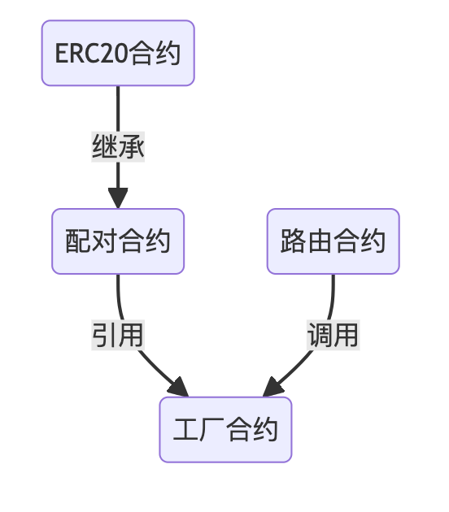

### **源码结构**

> _Uniswap 在 Github 上面开源了全部合约代码,其中包括__核心合约__,__周边合约__两部分.Uniswap 还开源了前端代码,前端代码使用 React 开发_

<u>核心合约</u>

[https://github.com/Uniswap/v2-core](https://github.com/Uniswap/v2-core)

<u>周边合约</u>

[https://github.com/Uniswap/v2-periphery](https://github.com/Uniswap/v2-periphery)

<u>前端代码</u>

[https://github.com/Uniswap/interface](https://github.com/Uniswap/interface)

> _在 Uniswap 的核心代码中,主要包含 3 个合约:__工厂合约__,__配对合约__,__ERC20 合约__.其中配对合约继承了 ERC20 合约,我们可以把它们看作一个合约.工厂合约通过__create2__方法部署配对合约,所以在部署合约时__只需要部署工厂合约__._ _周边合约中包括一些示例代码,例如价格预言机,闪电交换,其中最重要的是__路由合约__.在周边合约的代码库中,包含两个__路由合约__:__UnsiwapV2Router01__,__UnsiwapV2Router02__.工厂合约和配对合约需要通过路由合约调用才能更好的完成交易所的全部功能,所以我们__还要部署路由合约_

两个合约大部分相同,有小部分不同,如果将两个合约的差异化合并成一个合约,部署的时候将会出现 `out of gas`,所以才被分成了两个合约.常用功能两个合约中都包括,所以我们部署其中任意一个路由合约都可以



准备物料：

合约：

1. 工厂合约
2. 路由合约
3. weth 合约
4. multicall 合约

前端：

1. uniswap 前端
2. uniswap-sdk

### **从浏览器中下载合约源码**

> _如果你对合约代码并不熟悉,也可以跳过上面这部分,接下来我们将从以太坊浏览器中直接拷贝线上版合约源码_

工厂合约

[https://cn.etherscan.com/address/0x5C69bEe701ef814a2B6a3EDD4B1652CB9cc5aA6f#code](https://cn.etherscan.com/address/0x5C69bEe701ef814a2B6a3EDD4B1652CB9cc5aA6f#code)

<u>路由合约 01</u>[可选]

[https://cn.etherscan.com/address/0xf164fc0ec4e93095b804a4795bbe1e041497b92a#code](https://cn.etherscan.com/address/0xf164fc0ec4e93095b804a4795bbe1e041497b92a#code)

<u>路由合</u><u>约 02</u>

<u>[https://cn.etherscan.com/address/0x7a250d5630b4cf539739df2c5dacb4c659f2488d#code](https://cn.etherscan.com/address/0x7a250d5630b4cf539739df2c5dacb4c659f2488d#code)</u><u>约 02</u>

## remix **部署合约**

### **准备 WETH 合约地址**

> _在部署路由合约时,构造函数中需要填入工厂合约的地址和 WETH 合约的地址,由于 WETH 合约的地址在主网和测试网的地址都不相同,所以需要找到每个网络中 WETH 合约的地址._ _WETH 合约用于将 Eth 交换为 erc20 的 Eth,由于 Eth 不是 erc20 的 token,所以我们必须使用 WETH 作为交换媒介_

```
{
    mainnet:'0xC02aaA39b223FE8D0A0e5C4F27eAD9083C756Cc2',
    ropsten:'0xc778417E063141139Fce010982780140Aa0cD5Ab',
    rinkeby:'0xc778417E063141139Fce010982780140Aa0cD5Ab',
    goerli:'0xB4FBF271143F4FBf7B91A5ded31805e42b2208d6',
    kovan:'0xd0A1E359811322d97991E03f863a0C30C2cF029C'
}
```

### **使用 remix 部署合约**

> _将工厂合约和路由合约的线上版本导入到 remix 中,在编译合约的选项中,EVM VERSION 选择__istanbul__,COMPILER CONFIGURATION 中选择__Enable optimization_

### **部署脚本**

在编写 truffle 的部署脚本之前,先准备一个你的常用账户作为设置交易所手续费收取账户的管理员地址

然后在项目目录中运行命令,或者用编辑器创建文件 migrations/2_deploy_contract.js

### **部署合约**

> 现在我们就已经将 Uniswap 的路由合约和工厂合约都部署在所有的网络中了,你可以在控制台的信息中找到两个合约的地址,也可以在以太坊浏览器中找到,在以太坊浏览器中搜索新账户的地址,显示出来的新账户的交易信息中,将会显示两个创建合约的交易,`第二个创建的合约是路由合约`,将路由合约的地址记录下来

### **部署顺序和构造函数**

1. 部署工厂合约

- 构造函数的参数是一个自己常用的账户地址

1. 部署路由合约 01 [可选], 02

- 构造函数的参数 1 是工厂合约的地址
- 参数 2 是当前网络中 WETH 合约的地址,参考前文

### **uniswap-front-interface**

1. **源代码执行步骤**

```
将代码中的工厂合约地址，路由地址改为自己部署过的地址
打开infura.io创建一个自己的rinkeby网络
在 .env 和 .env.local 文件，将REACT_APP_CHAIN_ID和REACT_APP_NETWORK_URL修改为自己在infura.io创建的id和key
执行yarn，此时生成node_modules   // 清除缓存的命令是：yarn cache clwan --force
执行yarn start
```

## **部署 Uniswap 前端**

### **克隆前端代码**

> _在项目目录运行命令:_

```
$ git clone https://github.com/Uniswap/uniswap-interface.git
```

### **安装依赖库**

> _在项目目录运行命令:_

```
$ cd uniswap-interface
$ yarn
```

> _安装完成后,可以先测试运行一下,在 uniswap-interface 目录运行命令_

```
$ yarn start
```

> _如果运行成功,将会打开一个浏览器,同时打开 Uniswap 的前端界面_

### **修改路由地址**

> _在 Uniswap 的前端中以常量的形式定义了 Uniswap 的路由地址,我们只需要修改路由地址就可以让前端链接到你的路由合约中_ _修改文件:_ _项目目录/uniswap-interface/src/constants/index.ts_ _第 6 行_

```
import { AbstractConnector } from '@web3-react/abstract-connector'
import { ChainId, JSBI, Percent, Token, WETH } from '@uniswap/sdk'
import { fortmatic, injected, portis, walletconnect, walletlink } from '../connectors'
export const ROUTER_ADDRESS = '0x7a250d5630B4cF539739dF2C5dAcb4c659F2488D' //修改成你的路由合约地址
......
```

> _保存后运行__yarn start__即可看到效果_

## **扩展**

### **部署自己的 weth**

> _可以将以太坊浏览器中的 weth 源码拷贝下来,自己部署一个属于自己的 weth 合约_

### **可信 token 列表**

> _Uniswap 有一个自己的可信 token 列表,同样被设置在__项目目录/uniswap-interface/src/constants/index.ts__文件中,在最后一行就是.你可以将这个链接地址的文件拷贝下来,设置成自己需要的可信 token 地址列表,然后上传到 github 目录中,再修改 index.ts 文件中的链接地址,这样就可以让你自己的交易所中拥有自己设置的可信 token 列表了_
