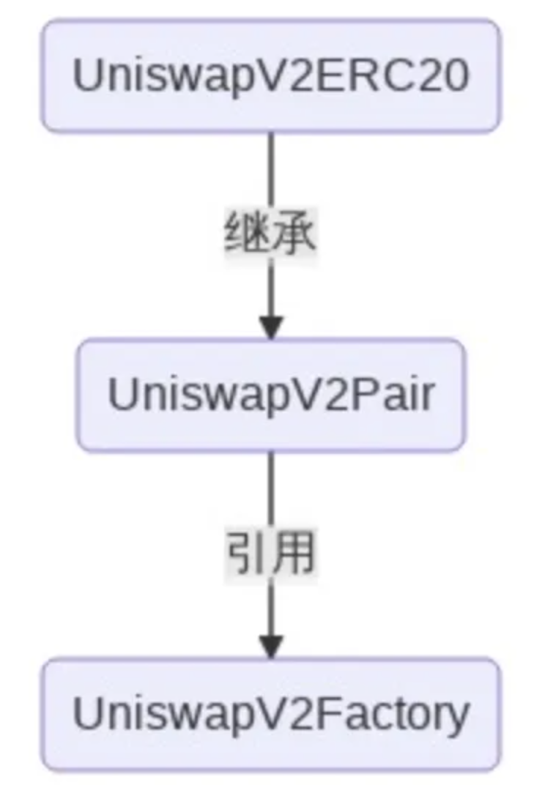
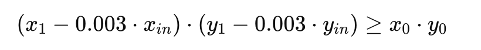
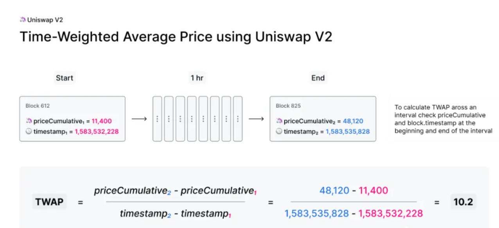
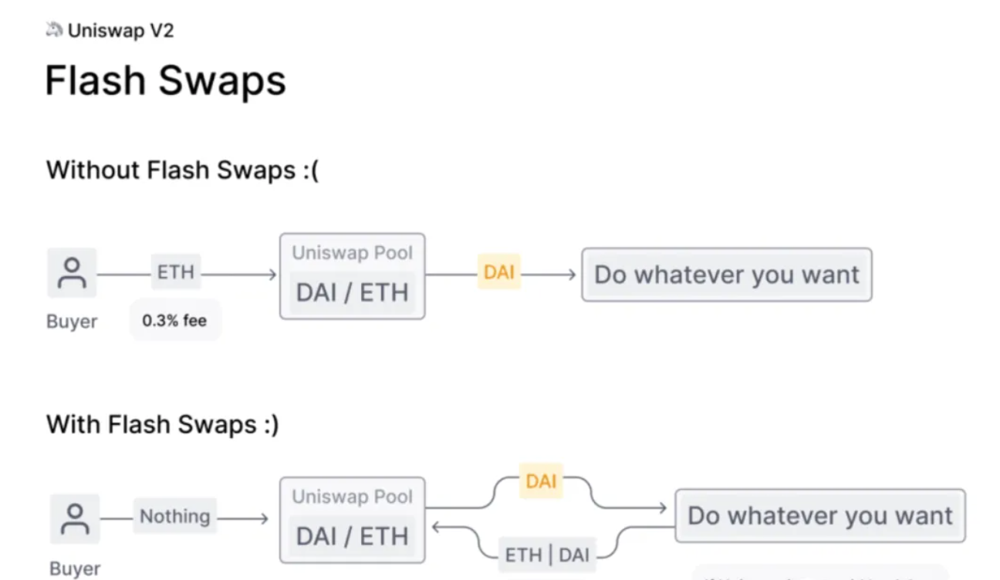

[https://github.com/Uniswap/v2-periphery](https://github.com/Uniswap/v2-periphery)

[https://github.com/Uniswap/v2-core](https://github.com/Uniswap/v2-core)

[https://github.com/Uniswap/v2-subgraph](https://github.com/Uniswap/v2-subgraph)

[https://github.com/Uniswap/info](https://github.com/Uniswap/info)

## 开源项目

整个 UniswapV2 产品拆分出了多个小型的开源项目，主要包括：

- uniswap-interface
- uniswap-v2-sdk
- uniswap-sdk-core
- uniswap-info
- uniswap-v2-subgraph
- uniswap-v2-core
- uniswap-v2-periphery
- uniswap-lib

前三个是前端 App 项目，即提供交易的项目，对应于 [https://app.uniswap.org](https://app.uniswap.org) 网页功能，展示页面都写在 _uniswap-interface_ 项目中，_uniswap-v2-sdk_ 和 _uniswap-sdk-core_ 则是作为 SDK 而存在，_uniswap-interface_ 会引用到 _v2-sdk_ 和 _sdk-core_，通过 _@uniswap/v2-sdk_ 和 _@uniswap/sdk-core_的方式引入到需要使用的 TS 文件中。

不过，_uniswap-interface_ 最新代码其实是跟线上同步的，即是集成了 V3 版本的。如果只想部署 V2 版本的前端，那可以找出历史版本的项目代码进行部署，如果是不带**流动性挖矿**功能，推荐 2020 年 9 月份的版本，如果是带挖矿功能，那可以试试 2020 年 10 月份的版本。

_uniswap-info_ 则是 **Uniswap Analytics** 项目，对应于官网页面 [https://info.uniswap.org](https://info.uniswap.org) ，展示了一些统计分析数据，其数据主要是从 Subgraph 读取。_uniswap-v2-subgraph_ 则是 Subgraph 项目了。

最后三个则是合约项目了，**uniswap-v2-core** 就是核心合约的实现； **uniswap-v2-periphery** 则提供了和 UniswapV2 进行交互的外围合约，主要就是路由合约；**uniswap-lib** 则封装了一些工具合约。**core** 和 **periphery** 里的合约实现是我们后面要重点讲解的内容。

## uniswap-v2-core

core 核心主要有三个合约文件：

- **UniswapV2Factory.sol**：工厂合约
- **UniswapV2Pair.sol**：配对合约
- **UniswapV2ERC20.sol**：LP Token 合约

**配对合约**管理着流动性资金池，不同币对有着不同的配对合约实例，比如 USDT-WETH 这一个币对，就对应一个配对合约实例，DAI-WETH 又对应另一个配对合约实例。

**LP Token** 则是用户往资金池里注入流动性的一种凭证，也称为**流动性代币**，本质上和 **Compound 的 cToken** 类似。当用户往某个币对的配对合约里转入两种币，即添加流动性，就可以得到配对合约返回的 LP Token，享受手续费分成收益。

每个配对合约都有对应的一种 LP Token 与之绑定。其实，**UniswapV2Pair** 继承了 **UniswapV2ERC20**，所以配对合约本身其实也是 LP Token 合约。

**工厂合约**则是用来部署配对合约的，通过工厂合约的 **createPair()** 函数来创建新的配对合约实例。



## 工厂合约

工厂合约最核心的函数就是  **createPair()** ，其实现代码如下：

```
function createPair(address tokenA, address tokenB) external returns (address pair) {
        require(tokenA != tokenB, 'UniswapV2: IDENTICAL_ADDRESSES');
        (address token0, address token1) = tokenA < tokenB ? (tokenA, tokenB) : (tokenB, tokenA);
        require(token0 != address(0), 'UniswapV2: ZERO_ADDRESS');
        require(getPair[token0][token1] == address(0), 'UniswapV2: PAIR_EXISTS'); // single check is sufficient
        bytes memory bytecode = type(UniswapV2Pair).creationCode;
        bytes32 salt = keccak256(abi.encodePacked(token0, token1));
        assembly {
            pair := create2(0, add(bytecode, 32), mload(bytecode), salt)
        }
        IUniswapV2Pair(pair).initialize(token0, token1);
        getPair[token0][token1] = pair;
        getPair[token1][token0] = pair; // populate mapping in the reverse direction
        allPairs.push(pair);
        emit PairCreated(token0, token1, pair, allPairs.length);
    }
```

里面创建合约采用了 **create2**，这是一个汇编 **opcode**，这是我要重点讲解的部分。

很多小伙伴应该都知道，一般创建新合约可以使用 **new** 关键字，比如，创建一个新配对合约，也可以这么写：

```
UniswapV2Pair newPair = new UniswapV2Pair();
```

那为什么不使用 new 的方式，而是调用 create2 操作码来新建合约呢？使用 create2 最大的好处其实在于：**可以在部署智能合约前预先计算出合约的部署地址**。最关键的就是以下这几行代码：

```
bytes memory bytecode = type(UniswapV2Pair).creationCode;
bytes32 salt = keccak256(abi.encodePacked(token0, token1));
assembly {
  pair := create2(0, add(bytecode, 32), mload(bytecode), salt)
}
```

第一行获取 **UniswapV2Pair** 合约代码的创建字节码 **creationCode**，结果值一般是这样：

```
0x0cf061edb29fff92bda250b607ac9973edf2282cff7477decd42a678e4f9b868
```

类似的，其实还有运行时的字节码 **runtimeCode**，但这里没有用到。

这个创建字节码其实会在 **periphery** 项目中的 **UniswapV2Library** 库中用到，是被硬编码设置的值。所以为了方便，可以在工厂合约中添加一行代码保存这个创建字节码：

```
bytes32 public constant INIT_CODE_PAIR_HASH = keccak256(abi.encodePacked(type(UniswapV2Pair).creationCode));
```

回到上面代码，第二行根据两个代币地址计算出一个盐值，对于任意币对，计算出的盐值也是固定的，所以也可以线下计算出该币对的盐值。

接着就用 **assembly** 关键字包起一段**内嵌汇编代码**，里面调用 **create2** 操作码来创建新合约。因为 UniswapV2Pair 合约的创建字节码是固定的，两个币对的盐值也是固定的，所以最终计算出来的 pair 地址其实也是固定的。

## UniswapV2ERC20 合约

配对合约继承了 _UniswapV2ERC20_ 合约，我们先来看看 _UniswapV2ERC20_ 合约的实现，这个比较简单。

_UniswapV2ERC20_ 是**流动性代币**合约，也称为 **LP Token**，但代币实际名称为 **Uniswap V2**，简称为 **UNI-V2**，都是直接在代码中定义好的：

```
string **public** constant name = 'Uniswap V2';
string **public** constant symbol = 'UNI-V2';
```

而代币的总量 **totalSupply** 最初为 0，可通过调用 **_mint()** 函数铸造出来，还可通过调用 **_burn()** 进行销毁。这两个函数的代码实现非常简单，就是直接在 **totalSupply** 和指定账户的 **balance** 上进行加减，只是，两个函数都是 **internal** 的，所以无法外部调用，代码如下：

```
function _mint(address to, uint value) internal {
  totalSupply = totalSupply.add(value);
  balanceOf[to] = balanceOf[to].add(value);
  emit Transfer(address(0), to, value);
}

function _burn(address from, uint value) internal {
  balanceOf[from] = balanceOf[from].sub(value);
  totalSupply = totalSupply.sub(value);
  emit Transfer(from, address(0), value);
}
```

另外，_UniswapV2ERC20_ 还提供了一个 **permit()** 函数，它允许用户在链下签署授权（approve）的交易，生成任何人都可以使用并提交给区块链的签名。关于 permit 函数具体的作用和用法，网上已经有很多介绍文章，我这里就不展开了。

除此之后，剩下的都是符合 _ERC20_ 标准的函数了。

## 配对合约

前面说过，配对合约是由工厂合约创建的，我们从构造函数和初始化函数中就可以看出来：

```
**constructor**() public {
 factory = msg.sender;
}

_// called once by the factory at time of deployment_
**function** **initialize**(address _token0, address _token1) **external** {
  require(msg.sender == factory, 'UniswapV2: FORBIDDEN'); _// sufficient check_
  token0 = _token0;
  token1 = _token1;
}
```

构造函数直接将 **msg.sender** 设为了 **factory** ，_factory_ 就是工厂合约地址。初始化函数 require 调用者需是工厂合约，而且工厂合约中只会初始化一次。

不过，不知道你有没有想到，为什么还要另外定义一个初始化函数，而不直接将 **_token0** 和 **_token1** 在构造函数中作为入参进行初始化呢？这是因为用 **create2** 创建合约的方式限制了构造函数不能有参数。

另外，配对合约中最核心的函数有三个：**mint()、burn()、swap()** 。分别是**添加流动性、移除流动性、兑换**三种操作的底层函数。

### mint() 函数

先来看看 _mint()_ 函数，主要是通过同时注入两种代币资产来获取流动性代币：

```
// this low-level function should be called from a contract which performs important safety checks
    function mint(address to) external lock returns (uint liquidity) {
        (uint112 _reserve0, uint112 _reserve1,) = getReserves(); // gas savings
        uint balance0 = IERC20(token0).balanceOf(address(this));
        uint balance1 = IERC20(token1).balanceOf(address(this));
        uint amount0 = balance0.sub(_reserve0);
        uint amount1 = balance1.sub(_reserve1);

        bool feeOn = _mintFee(_reserve0, _reserve1);
        uint _totalSupply = totalSupply; // gas savings, must be defined here since totalSupply can update in _mintFee
        if (_totalSupply == 0) {
            liquidity = Math.sqrt(amount0.mul(amount1)).sub(MINIMUM_LIQUIDITY);
           _mint(address(0), MINIMUM_LIQUIDITY); // permanently lock the first MINIMUM_LIQUIDITY tokens
        } else {
            liquidity = Math.min(amount0.mul(_totalSupply) / _reserve0, amount1.mul(_totalSupply) / _reserve1);
        }
        require(liquidity > 0, 'UniswapV2: INSUFFICIENT_LIQUIDITY_MINTED');
        _mint(to, liquidity);

        _update(balance0, balance1, _reserve0, _reserve1);
        if (feeOn) kLast = uint(reserve0).mul(reserve1); // reserve0 and reserve1 are up-to-date
        emit Mint(msg.sender, amount0, amount1);
    }
```

既然这是一个添加流动性的底层函数，那参数里为什么没有两个代币投入的数量呢？这可能是大部分人会想到的第一个问题。其实，调用该函数之前，**路由合约**已经完成了将用户的代币数量划转到该配对合约的操作。因此，你看前五行代码，通过获取两个币的当前余额 _balance0_ 和 _balance1_，再分别减去 __reserve0_ 和 __reserve1_，即池子里两个代币原有的数量，就计算得出了两个代币的投入数量 _amount0_和 _amount1_。另外，还给该函数添加了 **lock** 的修饰器，这是一个防止重入的修饰器，保证了每次添加流动性时不会有多个用户同时往配对合约里转账，不然就没法计算用户的 _amount0_ 和 _amount1_ 了。

第 6 行代码是计算协议费用的。在工厂合约中有一个 **feeTo** 的地址，如果设置了该地址不为零地址，就表示添加和移除流动性时会收取协议费用，但 Uniswap 一直到现在都没有设置该地址。

接着从第 7 行到第 15 行代码则是计算用户能得到多少流动性代币了。当 **totalSupply** 为 0 时则是最初的流动性，计算公式为：

```
liquidity = √(amount0*amount1) - MINIMUM_LIQUIDITY
```

即两个代币投入的数量相乘后求平方根，结果再减去最小流动性。最小流动性为 1000，该最小流动性会永久锁在零地址。这么做，主要还是为了安全，具体原因可以查看白皮书和官方文档的说明。

如果不是提供最初流动性的话，那流动性则是取以下两个值中较小的那个：

```
liquidity1 = amount0 * totalSupply / reserve0
liquidity2 = amount1 * totalSupply / reserve1
```

计算出用户该得的流动性 **liquidity** 之后，就会调用前面说的 __mint()_ 函数铸造出 _liquidity_ 数量的 _LP Token_ 并给到用户。

接着就会调用 **_update()** 函数，该函数主要做两个事情，一是更新 _reserve0_ 和 _reserve1_，二是累加计算 _price0CumulativeLast_ 和 _price1CumulativeLast_，这两个价格是用来计算 TWAP 的，后面再讲。

倒数第 2 行则是判断如果协议费用开启的话，更新 **kLast** 值，即 _reserve0_ 和 _reserve1_ 的乘积值，该值其实只在计算协议费用时用到。

最后一行就是触发一个 _Mint()_ 事件的发出。

### burn() 函数

接着就来看看 _burn()_ 函数了，这是**移除流动性**的底层函数：

```
// this low-level function should be called from a contract which performs important safety checks
    function burn(address to) external lock returns (uint amount0, uint amount1) {
        (uint112 _reserve0, uint112 _reserve1,) = getReserves(); // gas savings
        address _token0 = token0;                                // gas savings
        address _token1 = token1;                                // gas savings
        uint balance0 = IERC20(_token0).balanceOf(address(this));
        uint balance1 = IERC20(_token1).balanceOf(address(this));
        uint liquidity = balanceOf[address(this)];

        bool feeOn = _mintFee(_reserve0, _reserve1);
        uint _totalSupply = totalSupply; // gas savings, must be defined here since totalSupply can update in _mintFee
        amount0 = liquidity.mul(balance0) / _totalSupply; // using balances ensures pro-rata distribution
        amount1 = liquidity.mul(balance1) / _totalSupply; // using balances ensures pro-rata distribution
        require(amount0 > 0 && amount1 > 0, 'UniswapV2: INSUFFICIENT_LIQUIDITY_BURNED');
        _burn(address(this), liquidity);
        _safeTransfer(_token0, to, amount0);
        _safeTransfer(_token1, to, amount1);
        balance0 = IERC20(_token0).balanceOf(address(this));
        balance1 = IERC20(_token1).balanceOf(address(this));

        _update(balance0, balance1, _reserve0, _reserve1);
        if (feeOn) kLast = uint(reserve0).mul(reserve1); // reserve0 and reserve1 are up-to-date
        emit Burn(msg.sender, amount0, amount1, to);
    }
```

该函数主要就是销毁掉流动性代币并提取相应的两种代币资产给到用户。

这里面第一个不太好理解的就是第 6 行代码，获取当前合约地址的流动性代币余额。正常情况下，配对合约里是不会有流动性代币的，因为所有流动性代币都是给到了流动性提供者的。而这里有值，其实是因为**路由合约**会先把用户的流动性代币划转到该配对合约里。

第 7 行代码计算协议费用和 mint() 函数一样的。

接着就是计算两个代币分别可以提取的数量了，计算公式也很简单：

```
amount = liquidity / totalSupply * balance
提取数量 = 用户流动性 / 总流动性 * 代币总余额
```

我调整了下计算顺序，这样就能更好理解了。用户流动性除以总流动性就得出了用户在整个流动性池子里的占比是多少，再乘以代币总余额就得出用户应该分得多少代币了。举例：用户的 liquidity 为 1000，totalSupply 有 10000，即是说用户的流动性占比为 10%，那假如池子里现在代币总额有 2000 枚，那用户就可分得这 2000 枚的 10% 即 200 枚。

后面的逻辑就是调用 **_burn()** 销毁掉流动性代币，且将两个代币资产计算所得数量划转给到用户，最后更新两个代币的 reserve。

最后两行代码也和 mint() 函数一样，就不赘述了。

### swap() 函数

swap() 就是做兑换交易的底层函数了，来看看代码：

```
// this low-level function should be called from a contract which performs important safety checks
    function swap(uint amount0Out, uint amount1Out, address to, bytes calldata data) external lock {
        require(amount0Out > 0 || amount1Out > 0, 'UniswapV2: INSUFFICIENT_OUTPUT_AMOUNT');
        (uint112 _reserve0, uint112 _reserve1,) = getReserves(); // gas savings
        require(amount0Out < _reserve0 && amount1Out < _reserve1, 'UniswapV2: INSUFFICIENT_LIQUIDITY');

        uint balance0;
        uint balance1;
        { // scope for _token{0,1}, avoids stack too deep errors
        address _token0 = token0;
        address _token1 = token1;
        require(to != _token0 && to != _token1, 'UniswapV2: INVALID_TO');
        if (amount0Out > 0) _safeTransfer(_token0, to, amount0Out); // optimistically transfer tokens
        if (amount1Out > 0) _safeTransfer(_token1, to, amount1Out); // optimistically transfer tokens
        if (data.length > 0) IUniswapV2Callee(to).uniswapV2Call(msg.sender, amount0Out, amount1Out, data);
        balance0 = IERC20(_token0).balanceOf(address(this));
        balance1 = IERC20(_token1).balanceOf(address(this));
        }
        uint amount0In = balance0 > _reserve0 - amount0Out ? balance0 - (_reserve0 - amount0Out) : 0;
        uint amount1In = balance1 > _reserve1 - amount1Out ? balance1 - (_reserve1 - amount1Out) : 0;
        require(amount0In > 0 || amount1In > 0, 'UniswapV2: INSUFFICIENT_INPUT_AMOUNT');
        { // scope for reserve{0,1}Adjusted, avoids stack too deep errors
        uint balance0Adjusted = balance0.mul(1000).sub(amount0In.mul(3));
        uint balance1Adjusted = balance1.mul(1000).sub(amount1In.mul(3));
        require(balance0Adjusted.mul(balance1Adjusted) >= uint(_reserve0).mul(_reserve1).mul(1000**2), 'UniswapV2: K');
        }

        _update(balance0, balance1, _reserve0, _reserve1);
        emit Swap(msg.sender, amount0In, amount1In, amount0Out, amount1Out, to);
    }
```

该函数有 4 个入参，_amount0Out_ 和 _amount1Out_ 表示兑换结果要转出的 token0 和 token1 的数量，这两个值通常情况下是一个为 0，一个不为 0，但使用闪电交易时可能两个都不为 0。_to_ 参数则是接收者地址，最后的 _data_ 参数是执行回调时的传递数据，通过路由合约兑换的话，该值为 0。

前 3 行代码很好理解，第一步先校验兑换结果的数量是否有一个大于 0，然后读取出两个代币的 _reserve_，之后再校验兑换数量是否小于 _reserve_。

从第 6 行开始，到第 15 行结束，用了一对大括号，这主要是为了限制 __token{0,1}_ 这两个临时变量的作用域，防止堆栈太深导致错误。

接着，看看第 10 和 11 行，就开始将代币划转到接收者地址了。看到这里，有些小伙伴可能会产生疑问：这是个 _external_ 函数，任何用户都可以自行调用的，没有校验就直接划转了，那不是谁都可以随便提币了？其实，在后面是有校验的，我们往下看就知道了。

第 12 行，如果 _data_ 参数长度大于 0，则将 _to_ 地址转为 _IUniswapV2Callee_ 并调用其 _uniswapV2Call()_ 函数，这其实就是一个回调函数，_to_ 地址需要实现该接口。

第 13 和 14 行，获取两个代币当前的余额 _balance{0,1}_ ，而这个余额是扣减了转出代币后的余额。

第 16 和 17 行则是计算出实际转入的代币数量了。实际转入的数量其实也通常是一个为 0，一个不为 0 的。要理解计算公式的原理，我举一个实例来说明。

假设转入的是 token0，转出的是 token1，转入数量为 100，转出数量为 200。那么，下面几个值将如下：

```
amount0In = 100
amount1In = 0
amount0Out = 0
amount1Out = 200
```

而 _reserve0_ 和 _reserve1_ 假设分别为 1000 和 2000，没进行兑换交易之前，_balance{0,1}_ 和 _reserve{0,1}_ 是相等的。而完成了代币的转入和转出之后，其实，_balance0_ 就变成了 1000 + 100 - 0 = 1100，_balance1_ 变成了 2000 + 0 - 200 = 1800。整理成公式则如下：

```
balance0 = reserve0 + amount0In - amout0Out
balance1 = reserve1 + amount1In - amout1Out
```

反推一下就得到：

```
amountIn = balance - (reserve - amountOut)
```

这下就明白代码里计算 _amountIn_ 背后的逻辑了吧。

之后的代码则是进行扣减交易手续费后的恒定乘积校验，使用以下公式：

提取的公式是：



其中，_0.003_ 是交易手续费率，_X0_ 和 _Y0_ 就是 _reserve0_ 和 _reserve1_，_X1_ 和 _Y1_ 则是 _balance0_ 和 _balance1_，_Xin_ 和 _Yin_ 则对应于 _amount0In_ 和 _amount1In_。该公式成立就说明在进行这个底层的兑换之前的确已经收过交易手续费了。

## uniswap-v2-periphery

_periphery_ 项目的结构很简单，如下：

- **UniswapV2Migrator.sol**：迁移合约，从 V1 迁移到 V2 的合约
- **UniswapV2Router01.sol**：路由合约 01 版本
- **UniswapV2Router02.sol**：路由合约 02 版本，相比 01 版本主要增加了几个支持交税费用的函数
- **interfaces**：接口都统一放在该目录下
- **libraries**：存放用到的几个库文件
- **test**：里面有几个测试用的合约
- **examples**：一些很有用的示例合约，包括 TWAP、闪电兑换等

当然，我们没必要每个合约都讲，主要讲解最核心的 **UniswapV2Router02.sol**，即路由合约。

## UniswapV2Library

讲路由合约之前，我想先聊聊 _UniswapV2Library_ 这个库，路由合约很多函数的实现逻辑都用到了这个库提供的函数。_UniswapV2Library_ 主要提供了以下这些函数：

- **sortTokens**：对两个 token 进行排序
- **pairFor**：计算出两个 token 的 pair 合约地址
- **getReserves**：获取两个 token 在池子里里的储备量
- **quote**：根据给定的两个 token 的储备量和其中一个 token 数量，计算得到另一个 token 等值的数值
- **getAmountOut**：根据给定的两个 token 的储备量和输入的 token 数量，计算得到输出的 token 数量，该计算会扣减掉 0.3% 的手续费
- **getAmountIn**：根据给定的两个 token 的储备量和输出的 token 数量，计算得到输入的 token 数量，该计算会扣减掉 0.3% 的手续费
- **getAmountsOut**：根据兑换路径和输入数量，计算得到兑换路径中每个交易对的输出数量
- **getAmountsIn**：根据兑换路径和输出数量，计算得到兑换路径中每个交易对的输入数量

其中，第一个关键函数就是 ，用来计算得到两个 token 的配对合约地址，其代码实现是这样的：

```
// calculates the CREATE2 address for a pair without making any external calls
    function pairFor(address factory, address tokenA, address tokenB) internal pure returns (address pair) {
        (address token0, address token1) = sortTokens(tokenA, tokenB);
        pair = address(uint(keccak256(abi.encodePacked(
                hex'ff',
                factory,
                keccak256(abi.encodePacked(token0, token1)),
                hex'96e8ac4277198ff8b6f785478aa9a39f403cb768dd02cbee326c3e7da348845f' // init code hash
            ))));
    }
```

可以看到，有个「**init code hash**」是硬编码的。该值其实是 **UniswapV2Pair** 合约的 _creationCode_ 的哈希值。可以在 **UniswapV2Factory** 合约中添加以下常量获取到该值：

```
bytes32 public constant INIT_CODE_PAIR_HASH = keccak256(abi.encodePacked(type(UniswapV2Pair).creationCode));
```

另外，_INIT_CODE_PAIR_HASH_ 的值是带有 0x 开头的。而以上硬编码的 init code hash 前面已经加了 hex 关键字，所以单引号里的哈希值就不再需要 0x 开头。

接着，来看看 _getAmountOut_ 的实现：

```
// given an input amount of an asset and pair reserves, returns the maximum output amount of the other asset
    function getAmountOut(uint amountIn, uint reserveIn, uint reserveOut) internal pure returns (uint amountOut) {
        require(amountIn > 0, 'UniswapV2Library: INSUFFICIENT_INPUT_AMOUNT');
        require(reserveIn > 0 && reserveOut > 0, 'UniswapV2Library: INSUFFICIENT_LIQUIDITY');
        uint amountInWithFee = amountIn.mul(997);
        uint numerator = amountInWithFee.mul(reserveOut);
        uint denominator = reserveIn.mul(1000).add(amountInWithFee);
        amountOut = numerator / denominator;
    }
```

根据 AMM 的原理，恒定乘积公式「x * y = K」，兑换前后 K 值不变。因此，在不考虑交易手续费的情况下，以下公式会成立：

```
reserveIn * reserveOut = (reserveIn + amountIn) * (reserveOut - amountOut)
```

将公式右边的表达式展开，并推导下，就变成了：

```
reserveIn * reserveOut = reserveIn * reserveOut + amountIn * reserveOut - (reserveIn + amountIn) * amountOut
->
amountIn * reserveOut = (reserveIn + amountIn) * amountOut
->
amountOut = amountIn * reserveOut / (reserveIn + amountIn)
```

而实际上交易时，还需要扣减千分之三的交易手续费，所以实际上：

```
amountIn = amountIn * 997 / 1000
```

代入上面的公式后，最终结果就变成了：

```
amountOut = (amountIn * 997 / 1000) * reserverOut / (reserveIn + amountIn * 997 / 1000)
->
amountOut = amountIn * 997 * reserveOut / 1000 * (reserveIn + amountIn * 997 / 1000)
->
amountOut = amountIn * 997 * reserveOut / (reserveIn * 1000 + amountIn * 997)
```

这即是最后代码实现中的计算公式了。

_getAmountIn_ 是类似的，就不展开说明了。

最后，再来看看 _getAmountsOut_ 的代码实现：

```
// performs chained getAmountOut calculations on any number of pairs
    function getAmountsOut(address factory, uint amountIn, address[] memory path) internal view returns (uint[] memory amounts) {
        require(path.length >= 2, 'UniswapV2Library: INVALID_PATH');
        amounts = new uint[](path.length);
        amounts[0] = amountIn;
        for (uint i; i < path.length - 1; i++) {
            (uint reserveIn, uint reserveOut) = getReserves(factory, path[i], path[i + 1]);
            amounts[i + 1] = getAmountOut(amounts[i], reserveIn, reserveOut);
        }
    }
```

该函数会计算 path 中每一个中间资产和最终资产的数量，比如 path 为 [A,B,C]，则会先将 A 兑换成 B，再将 B 兑换成 C。返回值则是一个数组，第一个元素是 A 的数量，即 amountIn，而第二个元素则是兑换到的代币 B 的数量，最后一个元素则是最终要兑换得到的代币 C 的数量。

从代码中还可看到，每一次兑换其实都调用了 _getAmountOut_ 函数，这也意味着每一次中间兑换都会扣减千分之三的交易手续费。那如果兑换两次，实际支付假设为 1000，那最终实际兑换得到的价值只剩下：

```
1000 * (1 - 0.003) * (1 - 0.003) = 994.009
```

即实际支付的交易手续费将近千分之六了。兑换路径越长，实际扣减的交易手续费会更多，所以兑换路径一般不宜过长。

## UniswapV2Router02

_UniswapV2Router02_ 路由合约是与用户进行交互的入口，主要提供了**添加流动性、移除流动性**和**兑换**的系列接口，并提供了几个查询接口。

### 添加流动性接口

添加流动性，本质上就是支付两种代币，换回对应这两种代币的流动性代币 LP-Token。

添加流动性的接口有两个：

- **addLiquidity**：该接口支持添加两种 ERC20 代币作为流动性
- **addLiquidityETH**：与上一个接口不同，该接口提供的流动性资产，其中有一个是 ETH

我们先来看看第一个接口的实现代码：

```
function addLiquidity(
        address tokenA,
        address tokenB,
        uint amountADesired,
        uint amountBDesired,
        uint amountAMin,
        uint amountBMin,
        address to,
        uint deadline
    ) external override ensure(deadline) returns (uint amountA, uint amountB, uint liquidity) {
        (amountA, amountB) = _addLiquidity(tokenA, tokenB, amountADesired, amountBDesired, amountAMin, amountBMin);
        address pair = UniswapV2Library.pairFor(factory, tokenA, tokenB);
        TransferHelper.safeTransferFrom(tokenA, msg.sender, pair, amountA);
        TransferHelper.safeTransferFrom(tokenB, msg.sender, pair, amountB);
        liquidity = IUniswapV2Pair(pair).mint(to);
    }
```

先介绍下该接口的几个入参。tokenA 和 tokenB 就是配对的两个代币，tokenADesired 和 tokenBDesired 是预期支付的两个代币的数量，amountAMin 和 amountBMin 则是用户可接受的最小成交数量，to 是接收流动性代币的地址，deadline 是该笔交易的有效时间，如果超过该时间还没得到交易处理就直接失效不进行交易了。

这几个参数，amountAMin 和 amountBMin 有必要再补充说明一下。该值一般是由前端根据预期值和滑点值计算得出的。比如，预期值 amountADesired 为 1000，设置的滑点为 0.5%，那就可以计算得出可接受的最小值 amountAMin 为 1000 * (1 - 0.5%) = 995。

再来看代码实现逻辑，第一步是先调用内部函数 _addLiquidity()。来看看该函数的实现代码：

```
// **** ADD LIQUIDITY ****
    function _addLiquidity(
        address tokenA,
        address tokenB,
        uint amountADesired,
        uint amountBDesired,
        uint amountAMin,
        uint amountBMin
    ) private returns (uint amountA, uint amountB) {
        // create the pair if it doesn't exist yet
        if (IUniswapV2Factory(factory).getPair(tokenA, tokenB) == address(0)) {
            IUniswapV2Factory(factory).createPair(tokenA, tokenB);
        }
        (uint reserveA, uint reserveB) = UniswapV2Library.getReserves(factory, tokenA, tokenB);
        if (reserveA == 0 && reserveB == 0) {
            (amountA, amountB) = (amountADesired, amountBDesired);
        } else {
            uint amountBOptimal = UniswapV2Library.quote(amountADesired, reserveA, reserveB);
            if (amountBOptimal <= amountBDesired) {
                require(amountBOptimal >= amountBMin, 'UniswapV2Router: INSUFFICIENT_B_AMOUNT');
                (amountA, amountB) = (amountADesired, amountBOptimal);
            } else {
                uint amountAOptimal = UniswapV2Library.quote(amountBDesired, reserveB, reserveA);
                assert(amountAOptimal <= amountADesired);
                require(amountAOptimal >= amountAMin, 'UniswapV2Router: INSUFFICIENT_A_AMOUNT');
                (amountA, amountB) = (amountAOptimal, amountBDesired);
            }
        }
    }
```

该函数的返回值 amountA 和 amountB 是最终需要支付的数量。

实现逻辑还是比较简单的。先通过工厂合约查一下这两个 token 的配对合约是否已经存在，如果不存在则先创建该配对合约。接着读取出两个 token 的储备量，如果储备量都为 0，那两个预期支付额就是成交量。否则，根据两个储备量和 tokenA 的预期支付额，计算出需要支付多少 tokenB，如果计算得出的结果值 amountBOptimal 不比 amountBDesired 大，且不会小于 amountBMin，就可将 amountADesired 和该 amountBOptimal 作为结果值返回。如果 amountBOptimal 大于 amountBDesired，则根据 amountBDesired 计算得出需要支付多少 tokenA，得到 amountAOptimal，只要 amountAOptimal 不大于 amountADesired 且不会小于 amountAMin，就可将 amountAOptimal 和 amountBDesired 作为结果值返回。

再回到 addLiquidity 函数的实现，计算得出两个 token 实际需要支付的数量之后，调用了 UniswapV2Library 的 pairFor 函数计算出配对合约地址，接着就往 pair 地址进行转账了。因为用了 transferFrom 的方式，所以用户调用该函数之前，其实是需要先授权给路由合约的。

最后再调用 pair 合约的 mint 接口就可以得到流动性代币 liquidity 了。

以上就是 addLiquidity 的基本逻辑，很简单，所以非常好理解。

而 addLiquidityETH 则支付的其中一个 token 则是 ETH，而不是 ERC20 代币。来看看其代码实现：

```
function addLiquidityETH(
        address token,
        uint amountTokenDesired,
        uint amountTokenMin,
        uint amountETHMin,
        address to,
        uint deadline
    ) external override payable ensure(deadline) returns (uint amountToken, uint amountETH, uint liquidity) {
        (amountToken, amountETH) = _addLiquidity(
            token,
            WETH,
            amountTokenDesired,
            msg.value,
            amountTokenMin,
            amountETHMin
        );
        address pair = UniswapV2Library.pairFor(factory, token, WETH);
        TransferHelper.safeTransferFrom(token, msg.sender, pair, amountToken);
        IWETH(WETH).deposit{value: amountETH}();
        assert(IWETH(WETH).transfer(pair, amountETH));
        liquidity = IUniswapV2Pair(pair).mint(to);
        if (msg.value > amountETH) TransferHelper.safeTransferETH(msg.sender, msg.value - amountETH); // refund dust eth, if any
    }
```

可看到，入参不再是两个 token 地址，而只有一个 token 地址，因为另一个是以太坊主币 ETH。预期支付的 ETH 金额也是直接从 msg.value 读取的，所以入参里也不需要 ETH 的 Desired 参数。但是会定义 amountETHMin 表示愿意接受成交的 ETH 最小额。

实现逻辑上，请注意，调用 _addLiquidity 时传入的第二个参数是 WETH。其实，addLiquidityETH 实际上也是将 ETH 转为 WETH 进行处理的。可以看到代码中还有这么一行：

```
IWETH(WETH).deposit{value: amountETH}();
```

这就是将用户转入的 ETH 转成了 WETH。

而最后一行代码则会判断，如果一开始支付的 msg.value 大于实际需要支付的金额，多余的部分将返还给用户。

### 移除流动性接口

移除流动性本质上就是用流动性代币兑换出配对的两个币。

移除流动性的接口有 6 个：

- **removeLiquidity**：和 addLiquidity 相对应，会换回两种 ERC20 代币
- **removeLiquidityETH**：和 addLiquidityETH 相对应，换回的其中一种是主币 ETH
- **removeLiquidityWithPermit**：也是换回两种 ERC20 代币，但用户会提供签名数据使用 permit 方式完成授权操作
- **removeLiquidityETHWithPermit**：也是使用 permit 完成授权操作，换回的其中一种是主币 ETH
- **removeLiquidityETHSupportingFeeOnTransferTokens**：名字真长，功能和 removeLiquidityETH 一样，不同的地方在于支持转账时支付费用
- **removeLiquidityETHWithPermitSupportingFeeOnTransferTokens**：功能和上一个函数一样，但支持使用链下签名的方式进行授权

removeLiquidity 是这些接口中最核心的一个，也是其它几个接口的元接口。来看看其代码实现？

```
// **** REMOVE LIQUIDITY ****
    function removeLiquidity(
        address tokenA,
        address tokenB,
        uint liquidity,
        uint amountAMin,
        uint amountBMin,
        address to,
        uint deadline
    ) public override ensure(deadline) returns (uint amountA, uint amountB) {
        address pair = UniswapV2Library.pairFor(factory, tokenA, tokenB);
        IUniswapV2Pair(pair).transferFrom(msg.sender, pair, liquidity); // send liquidity to pair
        (uint amount0, uint amount1) = IUniswapV2Pair(pair).burn(to);
        (address token0,) = UniswapV2Library.sortTokens(tokenA, tokenB);
        (amountA, amountB) = tokenA == token0 ? (amount0, amount1) : (amount1, amount0);
        require(amountA >= amountAMin, 'UniswapV2Router: INSUFFICIENT_A_AMOUNT');
        require(amountB >= amountBMin, 'UniswapV2Router: INSUFFICIENT_B_AMOUNT');
    }
```

代码逻辑很简单，就 7 行代码。第一行，先计算出 pair 合约地址；第二行，将流动性代币从用户划转到 pair 合约；第三行，执行 pair 合约的 burn 函数实现底层操作，返回了两个代币的数量；第四行对两个代币做下排序；第五行根据排序结果确定 amountA 和 amountB；最后两行检验是否大于滑点计算后的最小值。

removeLiquidityETH 也同样简单，其实现代码如下：

```
function removeLiquidityETH(
        address token,
        uint liquidity,
        uint amountTokenMin,
        uint amountETHMin,
        address to,
        uint deadline
    ) public override ensure(deadline) returns (uint amountToken, uint amountETH) {
        (amountToken, amountETH) = removeLiquidity(
            token,
            WETH,
            liquidity,
            amountTokenMin,
            amountETHMin,
            address(this),
            deadline
        );
        TransferHelper.safeTransfer(token, to, amountToken);
        IWETH(WETH).withdraw(amountETH);
        TransferHelper.safeTransferETH(to, amountETH);
    }
```

因为流动性池子里实际存储的是 WETH，所以第一步调用 removeLiquidity 时第二个参数传的是 WETH。之后再调用 WETH 的 withdraw 函数将 WETH 转为 ETH，再将 ETH 转给用户。

removeLiquidityWithPermit 则是使用链下签名进行授权操作的，实现代码如下：

```
function removeLiquidityWithPermit(
        address tokenA,
        address tokenB,
        uint liquidity,
        uint amountAMin,
        uint amountBMin,
        address to,
        uint deadline,
        bool approveMax, uint8 v, bytes32 r, bytes32 s
    ) external override returns (uint amountA, uint amountB) {
        address pair = UniswapV2Library.pairFor(factory, tokenA, tokenB);
        uint value = approveMax ? uint(-1) : liquidity;
        IUniswapV2Pair(pair).permit(msg.sender, address(this), value, deadline, v, r, s);
        (amountA, amountB) = removeLiquidity(tokenA, tokenB, liquidity, amountAMin, amountBMin, to, deadline);
    }
```

其实就是在调用实际的 removeLiquidity 之前先用 permit 方式完成授权操作。

removeLiquidityETHWithPermit 也一样的，就不看代码了。

接着，来看看 removeLiquidityETHSupportingFeeOnTransferTokens 函数，先看看其代码实现：

```
// **** REMOVE LIQUIDITY (supporting fee-on-transfer tokens) ****
    function removeLiquidityETHSupportingFeeOnTransferTokens(
        address token,
        uint liquidity,
        uint amountTokenMin,
        uint amountETHMin,
        address to,
        uint deadline
    ) public virtual override ensure(deadline) returns (uint amountETH) {
        (, amountETH) = removeLiquidity(
            token,
            WETH,
            liquidity,
            amountTokenMin,
            amountETHMin,
            address(this),
            deadline
        );
        TransferHelper.safeTransfer(token, to, IERC20(token).balanceOf(address(this)));
        IWETH(WETH).withdraw(amountETH);
        TransferHelper.safeTransferETH(to, amountETH);
    }
```

该函数功能和 removeLiquidityETH 一样，但对比一下，就会发现主要不同点在于：

1. 返回值没有 amountToken；
2. 调用 removeLiquidity 后也没有 amountToken 值返回
3. 进行 safeTransfer 时传值直接读取当前地址的 token 余额。

有一些项目 token，其合约实现上，在进行 transfer 的时候，就会扣减掉部分金额作为费用，或作为税费缴纳，或锁仓处理，或替代 ETH 来支付 GAS 费。总而言之，就是某些 token 在进行转账时是会产生损耗的，实际到账的数额不一定就是传入的数额。该函数主要支持的就是这类 token。

### 兑换接口

兑换接口则多达 9 个：

- **swapExactTokensForTokens**：用 ERC20 兑换 ERC20，但支付的数量是指定的，而兑换回的数量则是未确定的
- **swapTokensForExactTokens**：也是用 ERC20 兑换 ERC20，与上一个函数不同，指定的是兑换回的数量
- **swapExactETHForTokens**：指定 ETH 数量兑换 ERC20
- **swapTokensForExactETH**：用 ERC20 兑换成指定数量的 ETH
- **swapExactTokensForETH**：用指定数量的 ERC20 兑换 ETH
- **swapETHForExactTokens**：用 ETH 兑换指定数量的 ERC20
- **swapExactTokensForTokensSupportingFeeOnTransferTokens**：指定数量的 ERC20 兑换 ERC20，支持转账时扣费
- **swapExactETHForTokensSupportingFeeOnTransferTokens**：指定数量的 ETH 兑换 ERC20，支持转账时扣费
- **swapExactTokensForETHSupportingFeeOnTransferTokens**：指定数量的 ERC20 兑换 ETH，支持转账时扣费

这么多个接口，我们就看看几个具有代表性的接口即可。首先是 swapExactTokensForTokens，其实现代码如下：

```
function swapExactTokensForTokens(
        uint amountIn,
        uint amountOutMin,
        address[] calldata path,
        address to,
        uint deadline
    ) external override ensure(deadline) returns (uint[] memory amounts) {
        amounts = UniswapV2Library.getAmountsOut(factory, amountIn, path);
        require(amounts[amounts.length - 1] >= amountOutMin, 'UniswapV2Router: INSUFFICIENT_OUTPUT_AMOUNT');
        TransferHelper.safeTransferFrom(path[0], msg.sender, UniswapV2Library.pairFor(factory, path[0], path[1]), amounts[0]);
        _swap(amounts, path, to);
    }
```

这是指定 amountIn 的兑换，比如用 tokenA 兑换 tokenB，那 amountIn 就是指定支付的 tokenA 的数量，而兑换回来的 tokenB 的数量自然是越多越好。

swapExactTokensForTokens 的实现逻辑就 4 行代码而已，非常简单。第一行计算出兑换数量，第二行判断是否超过滑动计算后的最小值，第三行将支付的代币转到 pair 合约，第四行再调用兑换的内部函数。那么，再来看看这个兑换的内部函数是如何实现的：

```
// **** SWAP ****
    // requires the initial amount to have already been sent to the first pair
    function _swap(uint[] memory amounts, address[] memory path, address _to) private {
        for (uint i; i < path.length - 1; i++) {
            (address input, address output) = (path[i], path[i + 1]);
            (address token0,) = UniswapV2Library.sortTokens(input, output);
            uint amountOut = amounts[i + 1];
            (uint amount0Out, uint amount1Out) = input == token0 ? (uint(0), amountOut) : (amountOut, uint(0));
            address to = i < path.length - 2 ? UniswapV2Library.pairFor(factory, output, path[i + 2]) : _to;
            IUniswapV2Pair(UniswapV2Library.pairFor(factory, input, output)).swap(amount0Out, amount1Out, to, new bytes(0));
        }
    }
```

可看到，其实现逻辑也不复杂，主要就是遍历整个兑换路径，并对路径中每两个配对的 token 调用 pair 合约的兑换函数，实现底层的兑换处理。

接着，来看看 swapTokensForExactTokens 的实现：

```
function swapTokensForExactTokens(
        uint amountOut,
        uint amountInMax,
        address[] calldata path,
        address to,
        uint deadline
    ) external override ensure(deadline) returns (uint[] memory amounts) {
        amounts = UniswapV2Library.getAmountsIn(factory, amountOut, path);
        require(amounts[0] <= amountInMax, 'UniswapV2Router: EXCESSIVE_INPUT_AMOUNT');
        TransferHelper.safeTransferFrom(path[0], msg.sender, UniswapV2Library.pairFor(factory, path[0], path[1]), amounts[0]);
        _swap(amounts, path, to);
    }
```

这是指定 amountOut 的兑换，比如用 tokenA 兑换 tokenB，那 amountOut 就是指定想要换回的 tokenB 的数量，而需要支付的 tokenA 的数量则是越少越好。因此，其实现代码，第一行其实就是用 amountOut 来计算得出需要多少 amountIn。返回的 amounts 数组，第一个元素就是需要支付的 tokenA 数量。其他的代码逻辑都很好理解了。

接着，来看看指定 ETH 的兑换，就以 swapExactETHForTokens 为例：

```
function swapExactETHForTokens(uint amountOutMin, address[] calldata path, address to, uint deadline)
        external
        override
        payable
        ensure(deadline)
        returns (uint[] memory amounts)
    {
        require(path[0] == WETH, 'UniswapV2Router: INVALID_PATH');
        amounts = UniswapV2Library.getAmountsOut(factory, msg.value, path);
        require(amounts[amounts.length - 1] >= amountOutMin, 'UniswapV2Router: INSUFFICIENT_OUTPUT_AMOUNT');
        IWETH(WETH).deposit{value: amounts[0]}();
        assert(IWETH(WETH).transfer(UniswapV2Library.pairFor(factory, path[0], path[1]), amounts[0]));
        _swap(amounts, path, to);
    }
```

支付的 ETH 数量是从 msg.value 中读取的。而且，可看到还调用了 WETH 的 deposit 函数，将 ETH 转为了 WETH 之后再转账给到 pair 合约。这说明和前面的流动性接口一样，是将 ETH 转为 WETH 进行底层处理的。

其他几个兑换接口的逻辑也是差不多的，就不再一一讲解了。剩下的主要想聊聊支持转账时扣费的接口，就以 swapExactTokensForTokensSupportingFeeOnTransferTokens 为例，该接口的实现代码如下：

```
function swapExactTokensForTokensSupportingFeeOnTransferTokens(
        uint amountIn,
        uint amountOutMin,
        address[] calldata path,
        address to,
        uint deadline
    ) external virtual override ensure(deadline) {
        TransferHelper.safeTransferFrom(
            path[0], msg.sender, UniswapV2Library.pairFor(factory, path[0], path[1]), amountIn
        );
        uint balanceBefore = IERC20(path[path.length - 1]).balanceOf(to);
        _swapSupportingFeeOnTransferTokens(path, to);
        require(
            IERC20(path[path.length - 1]).balanceOf(to).sub(balanceBefore) >= amountOutMin,
            'UniswapV2Router: INSUFFICIENT_OUTPUT_AMOUNT'
        );
    }
```

实现逻辑就只有 4 步，第一步先将 amountIn 转账给到 pair 合约，第二步读取出接收地址在兑换路径中最后一个代币的余额，第三步调用内部函数实现路径中每一步的兑换，第四步再验证接收者最终兑换得到的资产数量不能小于指定的最小值。

因为此类代币转账时可能会有损耗，所以就无法使用恒定乘积公式计算出最终兑换的资产数量，因此用交易后的余额减去交易前的余额来计算得出实际值。

而核心逻辑其实都在内部函数 _swapSupportingFeeOnTransferTokens 中实现，其代码如下：

```
// **** SWAP (supporting fee-on-transfer tokens) ****
    // requires the initial amount to have already been sent to the first pair
    function _swapSupportingFeeOnTransferTokens(address[] memory path, address _to) internal virtual {
        for (uint i; i < path.length - 1; i++) {
            (address input, address output) = (path[i], path[i + 1]);
            (address token0,) = UniswapV2Library.sortTokens(input, output);
            IUniswapV2Pair pair = IUniswapV2Pair(UniswapV2Library.pairFor(factory, input, output));
            uint amountInput;
            uint amountOutput;
            { // scope to avoid stack too deep errors
            (uint reserve0, uint reserve1,) = pair.getReserves();
            (uint reserveInput, uint reserveOutput) = input == token0 ? (reserve0, reserve1) : (reserve1, reserve0);
            amountInput = IERC20(input).balanceOf(address(pair)).sub(reserveInput);
            amountOutput = UniswapV2Library.getAmountOut(amountInput, reserveInput, reserveOutput);
            }
            (uint amount0Out, uint amount1Out) = input == token0 ? (uint(0), amountOutput) : (amountOutput, uint(0));
            address to = i < path.length - 2 ? UniswapV2Library.pairFor(factory, output, path[i + 2]) : _to;
            pair.swap(amount0Out, amount1Out, to, new bytes(0));
        }
    }
```

这里面最核心也较难理解的逻辑可能就是 amountInput 的计算，即理解好这一行代码，其他都很好理解：

```
amountInput = IERC20(input).balanceOf(address(pair)).sub(reserveInput);
```

因为 input 代币转账时可能会有损耗，所以在 pair 合约里实际收到多少代币，只能通过查出 pair 合约当前的余额，再减去该代币已保存的储备量，这才能计算出来实际值。

其他代码就比较容易理解，就不展开说明了。而其他支持此类转账代币的兑换接口，和前面说的兑换接口也是类似的，所以也不一一讲解了。

### 查询接口

查询接口有 5 个：

- **quote**
- **getAmountOut**
- **getAmountIn**
- **getAmountsOut**
- **getAmountsIn**

这几个查询接口的实现都是直接调用 UniswapV2Library 库对应的函数，所以也无需再赘述了。

剩下的一些内容，主要包括：**TWAP、FlashSwap、质押挖矿**。

## TWAP

**TWAP = Time-Weighted Average Price**，即**时间加权平均价格**，可用来创建有效防止价格操纵的**链上价格预言机**。

TWAP 的实现机制其实很简单。首先，在配对合约里会存储三个相关变量：

- **price0CumulativeLast**
- **price1CumulativeLast**
- **blockTimestampLast**

前两个变量是两个 token 的累加价格，最后一个变量则用来记录更新的区块时间。我们可以直接来看看其代码实现：

```
// update reserves and, on the first call per block, price accumulators
    function _update(uint balance0, uint balance1, uint112 _reserve0, uint112 _reserve1) private {
        require(balance0 <= uint112(-1) && balance1 <= uint112(-1), 'UniswapV2: OVERFLOW');
        uint32 blockTimestamp = uint32(block.timestamp % 2**32);
        uint32 timeElapsed = blockTimestamp - blockTimestampLast; // overflow is desired
        if (timeElapsed > 0 && _reserve0 != 0 && _reserve1 != 0) {
            // * never overflows, and + overflow is desired
            price0CumulativeLast += uint(UQ112x112.encode(_reserve1).uqdiv(_reserve0)) * timeElapsed;
            price1CumulativeLast += uint(UQ112x112.encode(_reserve0).uqdiv(_reserve1)) * timeElapsed;
        }
        reserve0 = uint112(balance0);
        reserve1 = uint112(balance1);
        blockTimestampLast = blockTimestamp;
        emit Sync(reserve0, reserve1);
    }
```

这是 **UniswapV2Pair** 合约的 __update_ 函数，每次 _mint_、_burn_、_swap_、_sync_ 时都会触发更新。实现逻辑很容易理解，主要就以下几步：

1. 读取当前的区块时间 blockTimestamp
2. 计算出与上一次更新的区块时间之间的时间差 timeElapsed
3. 如果 timeElapsed > 0 且两个 token 的 reserve 都不为 0，则更新两个累加价格
4. 更新两个 reserve 和区块时间 blockTimestampLast

有些人可能还是不太理解累加价格的意义，要把它理解透彻，先从当前时刻的价格说起，即 token0 和 token1 的当前价格，其实可以根据以下公式计算所得：

```
price0 = reserve1 / reserve0
price1 = reserve0 / reserve1
```

比如，假设两个 token 分别为 WETH 和 USDT，当前储备量分别为 10 WETH 和 40000 USDT，那么 WETH 和 USDT 的价格分别为：

```
price0 = 40000/10 = 4000 USDT
price1 = 10/40000 = 0.00025 WETH
```

现在，再加上时间维度来考虑。比如，当前区块时间相比上一次更新的区块时间，过去了 5 秒，那就可以算出这 5 秒时间的累加价格：

```
price0Cumulative = reserve1 / reserve0 * timeElapsed = 40000/10*5 = 20000 USDT
price1Cumulative = reserve0 / reserve1 * timeElapsed = 10/40000*5 = 0.00125 WETH
```

假设之后再过了 6 秒，最新的 reserve 分别变成了 12 WETH 和 32000 USDT，则最新的累加价格变成了：

```
price0CumulativeLast = price0Cumulative + reserve1 / reserve0 * timeElapsed = 20000 + 32000/12*6 = 36000 USDT
price1CumulativeLast = price1Cumulative + reserve0 / reserve1 * timeElapsed = 0.00125 + 12/32000*6 = 0.0035 WETH
```

这就是合约里所记录的累加价格了。

另外，每次计算时因为有 timeElapsed 的判断，所以其实每次计算的是每个区块的第一笔交易。而且，计算累加价格时所用的 reserve 是更新前的储备量，所以，实际上所计算的价格是之前区块的，因此，想要操控价格的难度也就进一步加大了。

有了前面的基础，接下来就可以计算 TWAP 即时间加权平均价格了。计算公式也很简单，如下图：



代入我们的例子，为了简化，我们将前面 5 秒时间的时刻记为 T1，累加价格记为 priceT1，而 6 秒时间后的时刻记为 T2，累加价格记为 priceT2。如此，可以计算出，在后面 6 秒时间里的平均价格：

```
twap = (priceT2 - priceT1)/(T2 - T1) = (36000 - 20000)/6 = 2666.66
```

在实际应用中，一般有两种计算方案，一是固定时间窗口的 TWAP，二是移动时间窗口的 TWAP。在 uniswap-v2-periphery 项目中，examples 目录下提供了这两种方案的示例代码，分为是 **ExampleOracleSimple.sol** 和 **ExampleSlidingWindowOracle.sol**，具体代码就不展开讲解了。

现在，Uniswap TWAP 已经被广泛应用于很多 DeFi 协议，很多时候会结合 Chainlink 一起使用。比如 Compound 就使用 Chainlink 进行喂价并加入 Uniswap TWAP 进行边界校验，防止价格波动太大。

## FlashSwap

FlashSwap，翻译过来就是**闪电兑换**，和**闪电贷（FlashLoan）** 有点类似。

从代码层面来说，闪电兑换的触发在 **UniswapV2Pair** 合约的 **swap** 函数里的，该函数里有这么一行代码：

```
if (data.length > 0) IUniswapV2Callee(to).uniswapV2Call(msg.sender, amount0Out, amount1Out, data);
```

这行代码主要说明了三个信息：

1. **to** 地址是一个合约地址
2. **to** 地址的合约实现了 **IUniswapV2Callee** 接口
3. 可以在 **uniswapV2Call** 函数里执行 **to** 合约自己的逻辑

一般情况下的兑换流程，是先支付 _tokenA_，再得到 _tokenB_。但闪电兑换却可以先得到 tokenB，最后再支付 tokenA。如下图：



即是说，通过闪电兑换，可以实现无前置成本的套利。

比如，在 Uniswap 上可以用 3000 DAI 兑换出 1 ETH，而在 Sushi 上可以将 1 ETH 兑换成 3100 DAI，这就存在 100 DAI 的套利空间了。但是，如果用户钱包里没有 DAI 的话，该怎么套利呢？通过 Uniswap 的闪电兑换，就可以先获得 ETH，再将 ETH 在 Sushi 卖出得到 DAI，最后支付 DAI 给到 Uniswap，这样就实现了无需前置资金成本的套利了。

理论上，只要利润空间能覆盖两边的交易手续费和 GAS，就值得执行套利。这种套利行为能使得不同 DEX 之间的价格趋于一致。

闪电兑换还可以应用于另一种场景。假设用户想在 Compound 抵押 ETH 借出 DAI，再用借出的 DAI 到 Uniswap 兑换成 ETH，再抵押到 Compound 借出更多 DAI，如此重复操作，从而提高做多 ETH 的杠杆率。这么做的效率非常低。而使用闪电兑换，可以大大提高交易效率：

1. 先从 Uniswap 得到 ETH
2. 将用户的 ETH 和从 Uniswap 得到的 ETH 抵押进 Compound
3. 从 Compound 借出 DAI
4. 在 Uniswap 支付 DAI

上述步骤也不需要重复执行，一次流程就实现了用户想要的杠杆率，相比之下，明显高效很多。

在 uniswap-v2-periphery 项目中，examples 目录下有个 **ExampleFlashSwap.sol**，就是实现闪电兑换的一个示例，实现的是在 UniswapV1 和 UniswapV2 之间套利。

## 质押挖矿

质押挖矿项目也同样很小，这是项目的 github 地址：

- [https://github.com/Uniswap/liquidity-staker](https://github.com/Uniswap/liquidity-staker)

总共只有四个 sol 文件：

- **IStakingRewards.sol**
- **RewardsDistributionRecipient.sol**
- **StakingRewards.sol**
- **StakingRewardsFactory.sol**

**IStakingRewards.sol** 是一个接口文件，定义了质押合约 **StakingRewards** 需要实现的一些函数，其中，Mutative 函数只有四个：

- **stake**：充值，即质押
- **withdraw**：提现，即解质押
- **getReward**：提取奖励
- **exit**：退出

剩下的则都是 View 函数：

- **lastTimeRewardApplicable**：有奖励的最近区块数
- **rewardPerToken**：每单位 Token 奖励数量
- **earned**：用户已赚但未提取的奖励数量
- **getRewardForDuration**：挖矿奖励总量
- **totalSupply**：总质押量
- **balanceOf**：用户的质押余额

**RewardsDistributionRecipient.sol** 则是一个抽象合约，跟常用的 Ownable 合约类似，我们可以直接看看其代码实现：

```
pragma solidity ^0.5.16;

contract RewardsDistributionRecipient {
    address public rewardsDistribution;

    function notifyRewardAmount(uint256 reward) external;

    modifier onlyRewardsDistribution() {
        require(msg.sender == rewardsDistribution, "Caller is not RewardsDistribution contract");
        _;
    }
}
```

总共就 12 行代码，rewardsDistribution 其实就是管理员地址，还有一个 onlyRewardsDistribution 的 modifier，这不就是和我们熟知的 Ownable 一样的功能嘛。另外，还定义了一个抽象函数 **notifyRewardAmount**，所以实际上这就是一个抽象合约。而继承了该合约的是 **StakingRewards** 合约，后面再细说。

StakingRewards.sol 留到最后再说，先来看看 **StakingRewardsFactory.sol**，这是一个工厂合约，主要就是用来部署 StakingRewards 合约的。

### StakingRewardsFactory

工厂合约里定义了四个变量：

- **rewardsToken**：用作奖励的代币，其实就是 UNI 代币
- **stakingRewardsGenesis**：质押挖矿开始的时间
- **stakingTokens**：用来质押的代币数组，一般就是各交易对的 LPToken
- **stakingRewardsInfoByStakingToken**：一个 mapping，用来保存质押代币和质押合约信息之间的映射

质押合约信息则是一个数据结构：

```
struct StakingRewardsInfo {
    address stakingRewards;
    uint rewardAmount;
}
```

其中，stakingRewards 其实就是 StakingRewards 合约（即质押合约）地址，rewardAmount 则是该质押合约每周期的奖励总量。

rewardsToken 和 stakingRewardsGenesis 在工厂合约的构造函数里就初始化的。除了构造函数，工厂合约还有三个函数：

- **deploy**
- **notifyRewardAmounts**
- **notifyRewardAmount**

deploy 就是部署 StakingRewards 合约的函数，其代码实现如下：

```
function deploy(address stakingToken, uint rewardAmount) public onlyOwner {
    StakingRewardsInfo storage info = stakingRewardsInfoByStakingToken[stakingToken];
    require(info.stakingRewards == address(0), 'StakingRewardsFactory::deploy: already deployed');

    info.stakingRewards = address(new StakingRewards(address(this), rewardsToken, stakingToken));
    info.rewardAmount = rewardAmount;
    stakingTokens.push(stakingToken);
}
```

两个入参，stakingToken 就是质押代币，一般为 LPToken；rewardAmount 则是奖励数量。

实现逻辑，先从 mapping 中读取出 info，如果 info 的 stakingRewards 不为零地址说明该质押代币的质押合约已经部署过了，不能重复部署。接着，用 new 的方式创建了 StakeingRewards 合约，并将合约地址赋值给 info.stakingRewards，将合约地址保存起来。之后，再保存 rewardAmount。最后，将 stakingToken 加到质押代币数组里。至此，质押合约的部署工作就完成了。

部署合约之后，下一步应该将用来挖矿的代币转入到质押合约中，这就要通过 **notifyRewardAmount** 函数了，其代码实现如下：

```
function notifyRewardAmount(address stakingToken) public {
    require(block.timestamp >= stakingRewardsGenesis, 'StakingRewardsFactory::notifyRewardAmount: not ready');

    StakingRewardsInfo storage info = stakingRewardsInfoByStakingToken[stakingToken];
    require(info.stakingRewards != address(0), 'StakingRewardsFactory::notifyRewardAmount: not deployed');

    if (info.rewardAmount > 0) {
        uint rewardAmount = info.rewardAmount;
        info.rewardAmount = 0;

        require(
        IERC20(rewardsToken).transfer(info.stakingRewards, rewardAmount),
        'StakingRewardsFactory::notifyRewardAmount: transfer failed'
        );
        StakingRewards(info.stakingRewards).notifyRewardAmount(rewardAmount);
    }
}
```

调用该函数之前，其实还有一个前提条件要先完成，那就是**需要先将用来挖矿奖励的 UNI 代币数量先转入该工厂合约**。有个这个前提，工厂合约的该函数才能实现将 UNI 代币下发到质押合约中去。

代码逻辑就很简单了，先是判断当前区块的时间需大于等于质押挖矿的开始时间。然后读取出指定的质押代币 stakingToken 映射的质押合约 info，要求 info 的质押合约地址不能为零地址，否则说明还没部署。再判断 info.rewardAmount 是否大于零，如果为零也不用下发奖励。if 语句里面的逻辑主要就是调用 rewardsToken 的 transfer 函数将奖励代币转发给质押合约，再调用质押合约的 notifyRewardAmount 函数触发其内部处理逻辑。另外，将 info.rewardAmount 重置为 0，可以避免向质押合约重复下发奖励代币。

而 **notifyRewardAmounts** 函数，则是遍历整个质押代币数组，对每个代币再调用 **notifyRewardAmount**，实现逻辑非常简单。

至此，工厂合约的代码逻辑就讲完了。下面，就来看看 StakingRewards 合约了。

### StakingRewards

**StakingRewards** 合约会继承 **RewardsDistributionRecipient** 合约和 **IStakingRewards** 接口。

StakingRewards 存储的变量则比较多，除了继承自 **RewardsDistributionRecipient** 抽象合约里的 rewardsDistribution 变量之外，还有 11 个变量：

- **rewardsToken**：奖励代币，即 UNI 代币
- **stakingToken**：质押代币，即 LPToken
- **periodFinish**：质押挖矿结束的时间，默认时为 0
- **rewardRate**：挖矿速率，即每秒挖矿奖励的数量
- **rewardsDuration**：挖矿时长，默认设置为 60 天
- **lastUpdateTime**：最近一次更新时间
- **rewardPerTokenStored**：每单位 token 奖励数量
- **userRewardPerTokenPaid**：用户的每单位 token 奖励数量
- **rewards**：用户的奖励数量
- **_totalSupply**：私有变量，总质押量
- **_balances**：私有变量，用户质押余额

前面讲工厂合约的 notifyRewardAmount 函数时，提到最后其实会调用到 StakingRewards 合约的 notifyRewardAmount 函数，我们就来看看这个函数是如何实现的：

```
function notifyRewardAmount(uint256 reward) external onlyRewardsDistribution updateReward(address(0)) {
    if (block.timestamp >= periodFinish) {
             rewardRate = reward.div(rewardsDuration);
    } else {
        uint256 remaining = periodFinish.sub(block.timestamp);
        uint256 leftover = remaining.mul(rewardRate);
        rewardRate = reward.add(leftover).div(rewardsDuration);
    }

    // Ensure the provided reward amount is not more than the balance in the contract.
    // This keeps the reward rate in the right range, preventing overflows due to
    // very high values of rewardRate in the earned and rewardsPerToken functions;
    // Reward + leftover must be less than 2^256 / 10^18 to avoid overflow.
    uint balance = rewardsToken.balanceOf(address(this));
    require(rewardRate <= balance.div(rewardsDuration), "Provided reward too high");

    lastUpdateTime = block.timestamp;
    periodFinish = block.timestamp.add(rewardsDuration);
    emit RewardAdded(reward);
}
```

该函数由工厂合约触发执行，而且根据工厂合约的代码逻辑，该函数也只会被触发一次。

由于 **periodFinish** 默认值为 0 且只会在该函数中更新值，所以只会执行 **block.timestamp >= periodFinish** 的分支逻辑，将从工厂合约转过来的挖矿奖励总量除以挖矿奖励时长，得到挖矿速率 **rewardRate**，即每秒的挖矿数量。理论上，else 分支是执行不到的，除非以后工厂合约升级为可以多次触发执行该函数。之后，读取 balance 并校验下 rewardRate，可以保证收取到的挖矿奖励余额也是充足的，rewardRate 就不会虚高。最后，更新 **lastUpdateTime** 和 **periodFinish**。periodFinish 就是在当前区块时间上加上挖矿时长，就得到了挖矿结束的时间。

接着，再来看看几个核心业务函数的实现，包括 stake、withdraw、getReward。

**stake** 就是质押代币的函数，实现代码如下：

```
function stake(uint256 amount) external nonReentrant updateReward(msg.sender) {
    require(amount > 0, "Cannot stake 0");
    _totalSupply = _totalSupply.add(amount);
    _balances[msg.sender] = _balances[msg.sender].add(amount);
    stakingToken.safeTransferFrom(msg.sender, address(this), amount);
    emit Staked(msg.sender, amount);
}
```

函数体内的代码逻辑很简单，将用户指定的质押量 amount 增加到 _totalSupply（总质押量）和 _balances（用户的质押余额），最后调用 stakingToken 的 safeTransferFrom 将代币从用户地址转入当前合约地址。

**withdraw** 则是用来提取质押代币的，代码实现也同样很简单，_totalSupply 和 _balances 都减掉提取数量，且将代币从当前合约地址转到用户地址：

```
function withdraw(uint256 amount) public nonReentrant updateReward(msg.sender) {
    require(amount > 0, "Cannot withdraw 0");
    _totalSupply = _totalSupply.sub(amount);
    _balances[msg.sender] = _balances[msg.sender].sub(amount);
    stakingToken.safeTransfer(msg.sender, amount);
    emit Withdrawn(msg.sender, amount);
}
```

**getReward** 是领取挖矿奖励的函数，内部逻辑主要就是从 rewards 中读取出用户有多少奖励并清零和转账给到用户：

```
function getReward() public nonReentrant updateReward(msg.sender) {
    uint256 reward = rewards[msg.sender];
    if (reward > 0) {
        rewards[msg.sender] = 0;
        rewardsToken.safeTransfer(msg.sender, reward);
        emit RewardPaid(msg.sender, reward);
    }
}
```

这几个核心业务函数体内的逻辑都非常好理解，值得一说的其实是每个函数声明最后的 **updateReward(msg.sender)**，这是一个更新挖矿奖励的 modifer，我们来看其代码：

```
modifier updateReward(address account) {
    rewardPerTokenStored = rewardPerToken();
    lastUpdateTime = lastTimeRewardApplicable();
    if (account != address(0)) {
        rewards[account] = earned(account);
        userRewardPerTokenPaid[account] = rewardPerTokenStored;
    }
    _;
}
```

主要逻辑就是更新几个字段，包括 rewardPerTokenStored、lastUpdateTime 和用户的奖励相关的 rewards[account] 和 userRewardPerTokenPaid[account]。

其中，还调用到其他三个函数：rewardPerToken()、lastTimeRewardApplicable()、earned(account)。先来看看这三个函数的实现。最简单的就是 lastTimeRewardApplicable：

```
function lastTimeRewardApplicable() public view returns (uint256) {
    return Math.min(block.timestamp, periodFinish);
}
```

其逻辑就是从**当前区块时间**和**挖矿结束时间**两者中返回最小值。因此，当挖矿未结束时返回的就是当前区块时间，而挖矿结束后则返回挖矿结束时间。也因此，挖矿结束后，lastUpdateTime 也会一直等于挖矿结束时间，这点很关键。

rewardPerToken 函数则是获取每单位质押代币的奖励数量，其实现代码如下：

```
function rewardPerToken() public view returns (uint256) {
    if (_totalSupply == 0) {
        return rewardPerTokenStored;
    }
    return
        rewardPerTokenStored.add(
            lastTimeRewardApplicable().sub(lastUpdateTime).mul(rewardRate).mul(1e18).div(_totalSupply)
        );
}
```

这其实就是用累加计算的方式存储到 rewardPerTokenStored 变量中。当挖矿结束后，则不会再产生增量，rewardPerTokenStored 就不会再增加了。

earned 函数则是计算用户当前的挖矿奖励，代码实现也只有一行代码：

```
function earned(address account) public view returns (uint256) {
    return _balances[account].mul(rewardPerToken().sub(userRewardPerTokenPaid[account])).div(1e18).add(rewards[account]);
}
```

其逻辑也是计算出增量的每单位质押代币的挖矿奖励，再乘以用户的质押余额得到增量的总挖矿奖励，再加上之前已存储的挖矿奖励，就得到当前总的挖矿奖励。

UniswapV2 的合约项目分为了好几个小项目，从架构设计上来说，能够大大减低不同模块之间的耦合性，不同项目也可以由不同的小团队单独维护，而且项目小而简单，那出 BUG 的概率也会更低。所以，这样的架构设计其实更适合 Dapp。
