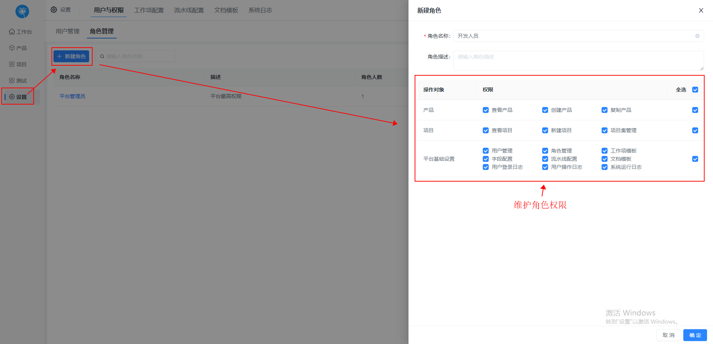
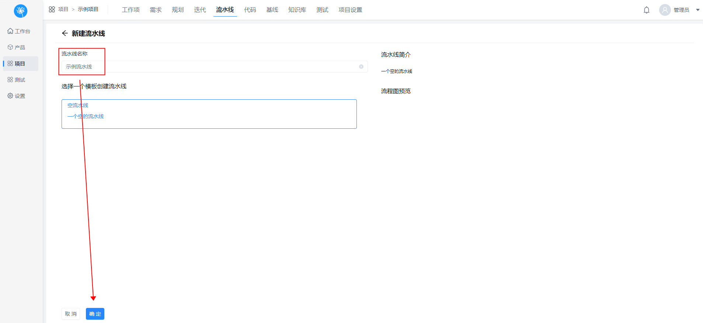
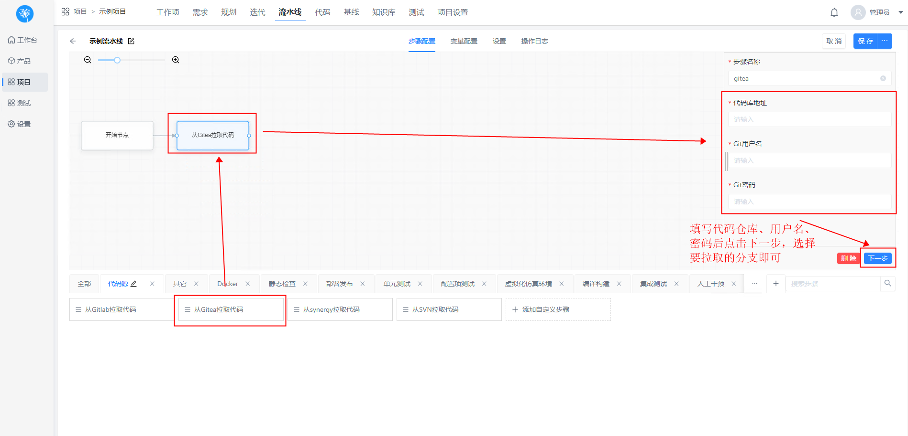

# 一、开发协同

DevOps协同开发是一种重视软件开发和IT运维之间沟通与合作的文化和实践。

DevOps协同开发的核心在于加强开发人员（Dev）与运维人员（Ops）之间的合作，通过自动化流程来提高软件的构建、测试和发布的效率和可靠性。这种协作模式鼓励团队赋权、跨团队沟通和协作以及技术自动化，以实现更快速、更频繁的软件交付。

DevOps协同开发的流程包括**项目立项、需求设计录入、迭代管理规划、迭代开发、迭代测试、持续发布、生产运维和回顾阶段**。

这个流程是一个高度自动化的过程，旨在优化开发、测试和运维的工作流程，以确保软件构建、测试和发布的快捷、频繁和可靠。在DevOps中，人、流程和平台的结合构成了一个完整的系统，其中人员涉及所有参与开发、测试和运维的人员，流程则包括从产品设计到最终部署上线的所有步骤，而平台则是支撑这些活动的工具和技术。

## 	1.系统成员权限管理

### 		①.系统角色管理

​				在系统设置下，用户与权限模块，可以进行平台角色的管理，包括角色的新建、编辑和删除；在此页面维护平台成员的权限：

### 		②.系统成员管理

​				在系统设置下，进行用户的添加，设置用户名、姓名和平台角色；添加成功后，账号密码默认为：000000

## 	2.工作项模板配置

​			在系统设置下，工作项配置模块，可以自定义配置工作项状态模板，根据实际业务流程，配置对应的看板列与状态：

## 	3.项目管理

### 		①.创建项目

​				进入项目-项目列表，可以新建项目：

### 		②.项目列表

​				项目列表提供父子项目关系呈现的树型列表形式，并展示对应项目的相关数据：

### 		③.项目成员权限管理

​				进入项目-项目设置-角色管理，实现对该项目下的角色权限维护：

​				进入项目-项目设置-项目成员，实现对该项目下的成员管理（项目下成员可以从系统成员中添加）：

### 		④.工作项管理，需求录入

​				工作项页面，汇总展示所有的需求、任务和缺陷数据，可进行工作项的创建，筛选，搜索，表头设置，以及切换查看方式。

​				需求模块只提供需求类型数据的汇总展示，用户可进行数据的筛选查看以及需求状态流程图的展示：

### 		⑤.迭代管理

​				提供迭代维护能力，用户可进行迭代的创建以及相关操作；在迭代下可以进行工作项的创建、编辑以及查看等；且在迭代在提供不同模式的查看方式；

### 		⑥.迭代规划

​	迭代规划提供以拖动卡片的形式快捷规划迭代，以及迭代相关数据查看：

### 		⑦.需求任务分发

​	迭代规划完成后，将该迭代内的需求分发到具体开发人员：

### 		⑧.开始迭代

​	需求任务分发完成后，开始迭代即可进入开发阶段：

​		在开发阶段，开发人员可以在迭代-敏捷看板视图，拖动负责的卡片到对应状态：

### 		⑨.完成迭代

​		当迭代内所有需求卡片拖动到已完成时，即表示该迭代开发完成，由迭代负责人验收通过后即可结束迭代：

# 二、流水线

流水线是DevOps文化中的重要组成部分，它通过自动化来确保软件开发和交付的速度与稳定性。流水线的核心组件包括构建自动化或持续集成（CI）、测试自动化以及部署自动化。这些组件共同工作，形成一个高效的工作流程，使得从代码提交到最终部署的过程变得顺畅且易于监控。

在DevOps流水线中，通常会涉及到以下几个阶段：

- **代码仓库**：开发人员将代码提交到版本控制系统，如Git。
- **编译构建**：流水线触发构建过程，执行代码编译、静态代码分析等任务。
- **自动化测试**：对构建产生的工件进行自动化测试，确保质量。
- **部署发布**：将通过测试的构建部署到不同的环境，如开发、测试、预生产和生产环境。

## 	1.新建流水线

​	新建或配置已有流水线，能够进入流水线画布步骤配置页面：

## 	2.配置流水线

### 	①.拉取代码

​			将步骤中的【从Gitea中拉取代码】拖动到画布中实现拉取代码，并配置好相关信息：

### 	②.QT编译

​			拉取代码后，将步骤中的【QT5】拖动到画布中，并配置好相关信息实现编译：

### 	③.远程传输

​			编译完成之后会有编译产物，若要实现部署，可以通过远程传输步骤将产物传输到目标机上实现部署操作：

## 	3.构建流水线

​		新建流水线后，通过点击该流水线的构建按钮，运行该流水线：

### 		